# CSE Department Website — Full-Stack Architecture & Reconstruction Blueprint

> **Version:** 2.0 (Clean Modular Architecture)  
> **Target Application:** Department of Computer Science & Engineering Web Platform  
> **Key Domains:** Public Portal, Faculty Academic Management System, Department CMS & Admin Portal, Dynamic Resume/Report Generation Engine.

---

## Table of Contents

1. [High-Level System Topology](#1-high-level-system-topology)
2. [Backend Architecture & Layered Design](#2-backend-architecture--layered-design)
   - [2.1 Clean Layered Pattern](#21-clean-layered-pattern)
   - [2.2 Core Middleware Pipeline](#22-core-middleware-pipeline)
   - [2.3 RESTful API Resource Routing Matrix](#23-restful-api-resource-routing-matrix)
   - [2.4 Report & Document Generation Engine](#24-report--document-generation-engine)
3. [Database Architecture & Structural Summary](#3-database-architecture--structural-summary)
   - [3.1 Relational Domain Summary (41 Tables)](#31-relational-domain-summary-41-tables)
   - [3.2 Visual Entity-Relationship (ER) Diagram](#32-visual-entity-relationship-er-diagram)
4. [Frontend Architecture & UI Portals](#4-frontend-architecture--ui-portals)
   - [4.1 Frontend Stack & Component System](#41-frontend-stack--component-system)
   - [4.2 Portal Routing Structure](#42-portal-routing-structure)
5. [Frontend Forms Specification & Validation Schemas](#5-frontend-forms-specification--validation-schemas)
   - [5.1 Authentication & Profile Forms](#51-authentication--profile-forms)
   - [5.2 Faculty CV Satellite Forms (1:N)](#52-faculty-cv-satellite-forms-1n)
   - [5.3 Research & Academic Output Forms (M:N)](#53-research--academic-output-forms-mn)
   - [5.4 Department CMS & Admin Management Forms](#54-department-cms--admin-management-forms)
   - [5.5 Placement Stats & Bulk Importers](#55-placement-stats--bulk-importers)
6. [Security, Invariants & Migration Checklist](#6-security-invariants--migration-checklist)

---

## 1. High-Level System Topology

```
┌────────────────────────────────────────────────────────────────────────┐
│                              CLIENT TIER                               │
│  ┌───────────────────────┐  ┌────────────────────┐  ┌────────────────┐ │
│  │ Public Portal Visitors │  │   Faculty Portal   │  │   Admin CMS    │ │
│  └───────────┬───────────┘  └─────────┬──────────┘  └────────┬───────┘ │
└──────────────┼────────────────────────┼──────────────────────┼─────────┘
               │                        │                      │
               ▼                        ▼                      ▼
┌────────────────────────────────────────────────────────────────────────┐
│                        FRONTEND APPLICATION TIER                       │
│                     Next.js 14+ (App Router / SSR)                     │
│    Tailwind CSS · Shadcn UI · TanStack Query · React Hook Form + Zod   │
└───────────────────────────────────┬────────────────────────────────────┘
                                    │ HTTPS / JSON REST API
                                    ▼
┌────────────────────────────────────────────────────────────────────────┐
│                         BACKEND APPLICATION TIER                       │
│        Node.js (Express / Fastify / NestJS) or Go / FastAPI / Nest     │
│  ┌──────────────────────────────────────────────────────────────────┐  │
│  │ Middlewares: Auth (JWT/RBAC), Helmet, CORS, RateLimit, Zod Valid │  │
│  ├──────────────────────────────────────────────────────────────────┤  │
│  │ Controllers ──► Business Services ──► Repositories / ORM Layer   │  │
│  ├──────────────────────────────────────────────────────────────────┤  │
│  │ Report Engine: DOCX Templating / Puppeteer PDF Generator         │  │
│  └──────────────────┬─────────────────────────────┬─────────────────┘  │
└─────────────────────┼─────────────────────────────┼────────────────────┘
                      │                             │
                      ▼                             ▼
       ┌─────────────────────────────┐ ┌─────────────────────────────┐
       │      DATA STORAGE TIER      │ │     MEDIA OBJECT STORAGE    │
       │       MySQL 8.0+ /          │ │    Cloudflare R2 / AWS S3   │
       │     PostgreSQL 15+          │ │    (Photos, PDF Circulars,  │
       │    (InnoDB, 41 Tables)      │ │     Syllabi, Hero Slides)   │
       └─────────────────────────────┘ └─────────────────────────────┘
```

---

## 2. Backend Architecture & Layered Design

### 2.1 Clean Layered Pattern

The backend follows the **Repository-Service-Controller (RSC)** design pattern to ensure strict separation of concerns, testability, and maintainability:

```
[ HTTP Request ]
       │
       ▼
┌──────────────┐     Validates token, role ('faculty' | 'admin'),
│ Middlewares  │ ──► rate limits, CORS, and request payload schemas (Zod).
└──────┬───────┘
       ▼
┌──────────────┐     Extracts params/body, invokes service,
│ Controllers  │ ──► formats standardized JSON responses (`success`, `data`, `error`).
└──────┬───────┘
       ▼
┌──────────────┐     Implements business logic, deduplication rules,
│   Services   │ ──► authorization checks, transactions, and document assembly.
└──────┬───────┘
       ▼
┌──────────────┐     Encapsulates database operations (Prisma / Drizzle / Sequelize),
│ Repositories │ ──► complex SQL joins, composite PK linkages, and aggregate counts.
└──────┬───────┘
       ▼
[ Database Engine ]
```

---

### 2.2 Core Middleware Pipeline

1. **`corsHandler`**: Restricts origins to approved frontend domains with preflight caching.
2. **`securityHeaders`**: Sets HTTP security headers via `helmet` (CSP, HSTS, X-Content-Type-Options).
3. **`rateLimiter`**: Redis/Memory token-bucket limiter (e.g., 100 req/min for public GETs; 10 req/min for auth endpoints).
4. **`authenticate`**: Verifies Bearer JWT tokens or HTTP-only session cookies. Injects `req.user = { id, facultyId, role, email }`.
5. **`authorize(allowedRoles)`**: Enforces Role-Based Access Control (`'faculty'`, `'admin'`). Prevents cross-faculty resource tampering (`req.user.facultyId === targetFacultyId` or `'admin'`).
6. **`validateSchema(zodSchema)`**: Validates request body, query params, and URL params before reaching controllers. Returns `422 Unprocessable Entity` with field-level error messages.
7. **`fileUpload`**: Streams multi-part file uploads (images/PDFs) directly to S3/Cloudflare R2, returning canonical public CDN URLs.
8. **`errorHandler`**: Centralized error middleware converting domain exceptions to uniform JSON envelopes:
   ```json
   {
     "success": false,
     "error": {
       "code": "RESOURCE_DUPLICATE",
       "message": "A publication with this DOI already exists.",
       "details": []
     }
   }
   ```

---

### 2.3 RESTful API Resource Routing Matrix

| Module | Route Prefix | Method | Action / Purpose | Auth & RBAC |
|---|---|---|---|---|
| **Auth** | `/api/v1/auth/login` | `POST` | User login (returns JWT + user profile) | Public |
| | `/api/v1/auth/forgot-password` | `POST` | Dispatches password reset email token | Public |
| | `/api/v1/auth/reset-password` | `POST` | Verifies reset token and updates password | Public |
| | `/api/v1/auth/change-password`| `POST` | Changes password (clears `first_login` flag) | Auth (Faculty/Admin) |
| **Faculty Profile** | `/api/v1/faculty` | `GET` | Get directory of all active faculty | Public |
| | `/api/v1/faculty/:id/portfolio`| `GET` | Get full faculty profile + all CV sections | Public |
| | `/api/v1/faculty/profile` | `PUT` | Update authenticated faculty extended profile | Auth (Faculty/Admin) |
| **CV Satellites** | `/api/v1/faculty/qualifications` | `GET / POST` | Read / Create educational qualifications | Auth (Faculty/Admin) |
| | `/api/v1/faculty/qualifications/:id` | `PUT / DELETE`| Update / Delete qualification | Auth (Owner/Admin) |
| | `/api/v1/faculty/teaching-exp` | `CRUD` | Manage teaching appointments | Auth (Owner/Admin) |
| | `/api/v1/faculty/admin-exp` | `CRUD` | Manage administrative experiences | Auth (Owner/Admin) |
| | `/api/v1/faculty/honors` | `CRUD` | Manage honors, awards, and recognitions | Auth (Owner/Admin) |
| | `/api/v1/faculty/exposures` | `CRUD` | Manage national/international visits | Auth (Owner/Admin) |
| | `/api/v1/faculty/expert-talks` | `CRUD` | Manage delivered keynotes and lectures | Auth (Owner/Admin) |
| **Research Output** | `/api/v1/publications` | `GET` | Filter publications (by year, type, index) | Public |
| | `/api/v1/publications` | `POST` | Create publication + link co-authors | Auth (Faculty/Admin) |
| | `/api/v1/publications/:id` | `PUT / DELETE`| Update publication metadata / unlink | Auth (Co-Author/Admin)|
| | `/api/v1/patents` | `CRUD` | Manage patent applications & grants | Public (GET) / Auth |
| | `/api/v1/projects` | `CRUD` | Manage sponsored R&D projects | Public (GET) / Auth |
| | `/api/v1/consultancies` | `CRUD` | Manage industrial consultancy projects | Public (GET) / Auth |
| | `/api/v1/research-supervisions`| `CRUD` | Manage M.Tech/Ph.D. scholar supervisions | Public (GET) / Auth |
| | `/api/v1/courses` | `CRUD` | Manage courses & teaching assignments | Public (GET) / Auth |
| | `/api/v1/events` | `CRUD` | Manage conferences, workshops & STCs | Public (GET) / Auth |
| **CMS & Content** | `/api/v1/announcements` | `GET` | List notices (filtered by public/private) | Public (Auth for Private)|
| | `/api/v1/announcements` | `POST / DELETE`| Create / Remove notice circulars | Auth (Admin) |
| | `/api/v1/posts` | `GET / POST` | Manage achievements and news posts | Public (GET) / Admin |
| | `/api/v1/home-slides` | `CRUD` | Manage homepage carousel images | Public (GET) / Admin |
| | `/api/v1/hod-message` | `GET / PUT` | Read / Update HOD greeting & photo | Public (GET) / Admin |
| | `/api/v1/qna` | `CRUD` | Manage department FAQ items | Public (GET) / Admin |
| | `/api/v1/documents` | `CRUD` | Manage syllabus & academic calendars | Public (GET) / Admin |
| **People & Students**| `/api/v1/staff` | `CRUD` | Manage staff directory | Public (GET) / Admin |
| | `/api/v1/students` | `GET / POST` | Filter students by program/sem; bulk import | Public (GET) / Admin |
| | `/api/v1/phd-scholars` | `CRUD` | Manage doctoral scholar directory | Public (GET) / Admin |
| **Facilities & Stats**| `/api/v1/labs` | `CRUD` | Manage computing lab infrastructure | Public (GET) / Admin |
| | `/api/v1/equipment` | `CRUD` | Manage hardware & instrument assets | Public (GET) / Admin |
| | `/api/v1/placement-stats` | `CRUD` | Manage annual placement records | Public (GET) / Admin |
| **Reports & Export** | `/api/v1/reports/resume` | `GET` | Generate Word DOCX / PDF faculty resume | Auth (Faculty/Admin) |
| | `/api/v1/reports/annual` | `GET` | Generate Department Annual Report by Session | Auth (Admin) |

---

### 2.4 Report & Document Generation Engine

The platform features an automated document compilation pipeline:
1. **Faculty Resume Generator:** Queries all 9 CV satellites and research output join tables for a given `faculty_id`, builds a structured JSON view model, and renders a formatted Word (`.docx`) file via XML template replacement (`docxtemplater`) or PDF via headless Chromium (`puppeteer`).
2. **Annual Departmental Report Generator:** Aggregates publications, patents, projects, events, expert talks, and equipment procurements grouped by `academic_session` (e.g. `'2023-2024'`), compiling institutional accreditation reports (NBA/NAAC/NIRF).

---

## 3. Database Architecture & Structural Summary

The database consists of **41 tables** categorized across **6 core domains**. All relations, field data types, nullability, constraints, indexes, and cascades are formally defined in [CSE_DATABASE_ER_SCHEMA.md](file:///home/divyansh/Development/Projects/tempcsebase/CSE_DATABASE_ER_SCHEMA.md).

### 3.1 Relational Domain Summary (41 Tables)

```
├── 1. Lookups (3 tables)
│   ├── programs (id [1..4], name)
│   ├── research_types (id [1..4], name)
│   └── supervision_types (id [1..2], name)
│
├── 2. Core Identity, People & Auth (6 tables)
│   ├── faculty (id, faculty_code [UK], name, email [UK], position, is_permanent, ...)
│   ├── faculty_profiles (1:1 satellite: faculty_id [FK,UK], orcid, scopus, scholar, ...)
│   ├── user_accounts (faculty_id [FK,UK], username [UK], role, password_hash, first_login)
│   ├── staff (id, name, email [UK], designation, photo_url, time)
│   ├── students (id, roll_no [UK], email [UK], program_id [FK], current_semester, admission_year)
│   └── phd_scholars (id, name, roll_no, supervisor, status, dissertation_title, ...)
│
├── 3. Faculty CV Satellites (6 tables — 1:N Cascading)
│   ├── faculty_qualifications (faculty_id [FK], degree_name, university_name, passing_year)
│   ├── faculty_teaching_experiences (faculty_id [FK], position, department, start_date, end_date)
│   ├── faculty_administrative_experiences (faculty_id [FK], position, organisation, dates)
│   ├── faculty_honors (faculty_id [FK], title, given_by, year)
│   ├── faculty_exposures (faculty_id [FK], title, description)
│   └── expert_talks (faculty_id [FK], title, venue, academic_session, dates)
│
├── 4. Scholarly Research Output (14 tables = 7 Entities + 7 M:N Associative Joins)
│   ├── publications ───────◄ faculty_publications (PK: publication_id, faculty_id)
│   ├── patents ────────────◄ faculty_patents (PK: patent_id, faculty_id)
│   ├── projects ───────────◄ faculty_projects (PK: project_id, faculty_id)
│   ├── consultancies ──────◄ faculty_consultancies (PK: consultancy_id, faculty_id)
│   ├── research_supervisions ◄ faculty_research_supervisions (PK: supervision_id, faculty_id)
│   ├── courses ────────────◄ faculty_courses (PK: course_id, faculty_id)
│   └── events ─────────────◄ faculty_events (PK: event_id, faculty_id)
│
├── 5. Department CMS & Content (9 tables)
│   ├── announcements (id, title, pdf_url, announced_on, is_private)
│   ├── posts (id, category ['achievement'|'academic_news'], title, description, photo_url, pdf_url)
│   ├── about_sections (id, title, description)
│   ├── programs_offered (id, title, description)
│   ├── home_slides (id, image_url)
│   ├── hod_messages (id, faculty_id [FK,NULL], name, message, image_url)
│   ├── qna (id, question, answer)
│   ├── syllabus_documents (id, title, pdf_url)
│   └── calendar_documents (id, title, pdf_url)
│
└── 6. Facilities, Assets & Analytics (3 tables)
    ├── labs (id, title, description, photo_url, officer_in_charge, technician)
    ├── equipment (id, name, quantity, stock, invoice_no, vendor, amount, academic_session)
    └── placement_stats (id, branch, year [UK(branch,year)], candidates, placed, jobs_offered, max_ctc, placed_percent [GEN], offers_percent [GEN])
```

---

### 3.2 Visual Entity-Relationship (ER) Diagram

```mermaid
erDiagram
    %% Lookups
    programs ||--o{ students : "enrolled in (program_id)"
    research_types ||--o{ publications : "categorizes (research_type_id)"
    supervision_types ||--o{ research_supervisions : "categorizes (supervision_type_id)"

    %% Identity & Satellites
    faculty ||--|| faculty_profiles : "1:1 profile (faculty_id)"
    faculty ||--o| user_accounts : "auth (faculty_id)"
    faculty ||--o{ faculty_qualifications : "earned (faculty_id)"
    faculty ||--o{ faculty_teaching_experiences : "taught (faculty_id)"
    faculty ||--o{ faculty_administrative_experiences : "held (faculty_id)"
    faculty ||--o{ faculty_honors : "awarded (faculty_id)"
    faculty ||--o{ faculty_exposures : "attended (faculty_id)"
    faculty ||--o{ expert_talks : "delivered (faculty_id)"
    faculty ||--o{ hod_messages : "optional attribution (faculty_id)"

    %% M:N Research Associations
    faculty ||--o{ faculty_publications : "co-author"
    publications ||--o{ faculty_publications : "internal authors"

    faculty ||--o{ faculty_patents : "inventor"
    patents ||--o{ faculty_patents : "faculty inventors"

    faculty ||--o{ faculty_projects : "investigator"
    projects ||--o{ faculty_projects : "faculty investigators"

    faculty ||--o{ faculty_consultancies : "consultant"
    consultancies ||--o{ faculty_consultancies : "faculty consultants"

    faculty ||--o{ faculty_research_supervisions : "advisor"
    research_supervisions ||--o{ faculty_research_supervisions : "faculty advisors"

    faculty ||--o{ faculty_courses : "instructor"
    courses ||--o{ faculty_courses : "faculty instructors"

    faculty ||--o{ faculty_events : "coordinator"
    events ||--o{ faculty_events : "faculty coordinators"

    %% Key definitions
    faculty {
        int id PK
        string faculty_code UK
        string name
        string email UK
        string position
        boolean is_permanent
        int sort_order
    }
    user_accounts {
        int id PK
        int faculty_id FK,UK
        string username UK
        enum role
        string password_hash
        boolean first_login
    }
    publications {
        int id PK
        string title
        string doi UK
        int research_type_id FK
        enum indexing
        year year
        string author_text
    }
    patents {
        int id PK
        string reference_no UK
        string title
        string status
        year year
    }
    projects {
        int id PK
        string reference_no UK
        string title
        string status
        decimal funding_amount
        string funding_agency
    }
    students {
        int id PK
        string roll_no UK
        string email UK
        int program_id FK
        tinyint current_semester
        smallint admission_year
    }
    placement_stats {
        int id PK
        string branch
        year year
        smallint candidates
        smallint placed
        decimal placed_percent "GENERATED"
    }
```



---

## 4. Frontend Architecture & UI Portals

### 4.1 Frontend Stack & Component System

- **Framework:** Next.js 14+ (App Router, Server & Client Components)
- **Styling:** Vanilla Tailwind CSS with design tokens for dark/light mode themes.
- **UI Components:** Shadcn UI (Radix UI primitives for dialogs, popovers, select dropdowns, tables, tabs, toasts).
- **Form Management:** React Hook Form + Zod schema validation.
- **Data Fetching & Cache:** TanStack Query (React Query) with optimistic UI updates and cache invalidation.
- **Rich Text / Media:** Lucide React icons, TipTap / Markdown editor for CMS prose.

---

### 4.2 Portal Routing Structure

```
frontend/src/app/
│
├── (website)/                         # 1. PUBLIC DEPARTMENT WEBSITE
│   ├── layout.tsx                     # Global Header, Sticky Nav, Footer
│   ├── page.tsx                       # Hero Carousel, Quick Links, Dynamic News Feed, Counters
│   ├── aboutus/                       # Vision, Mission, History, Infrastructure
│   │   ├── hod/                       # Head of Department Message
│   │   ├── labs/                      # Computing Labs Directory & Facilities
│   │   ├── equipment/                 # Equipment & Assets Catalog
│   │   └── faq/                       # Department FAQs (Q&A Accordion)
│   ├── academics/                     # Programs Offered, Course Structure
│   │   ├── courses/                   # Course Catalog with Semester & Level Filters
│   │   ├── syllabus/                  # Downloadable Syllabus PDFs
│   │   └── calendar/                  # Academic Calendars
│   ├── people/                        # People Directory with Search & Filtering
│   │   ├── faculty/                   # Faculty Cards Grid (Filtered by Rank/Permanent)
│   │   │   └── [facultyCode]/         # Comprehensive Public Portfolio / CV Page
│   │   ├── staff/                     # Technical & Admin Staff Cards
│   │   ├── students/                  # Enrolled Students Directory (Filter: Program, Sem, Year)
│   │   └── phd-scholars/              # PhD Scholars Catalog (Status: Pursuing / Passed)
│   ├── research/                      # Research Overview & Aggregated Outputs
│   │   ├── publications/              # Publications List (Filters: Type, Indexing, Session, Year)
│   │   ├── patents/                   # Patents Directory
│   │   ├── projects/                  # Sponsored Projects Catalog
│   │   ├── consultancies/             # Industrial Consultancy Registry
│   │   └── supervisions/              # Research Supervisions Catalog
│   ├── news/                          # Announcements & Achievements
│   │   ├── announcements/             # Public Notice Circulars with PDF Links
│   │   └── achievements/              # Department News & Accolade Cards
│   └── placementpage/                 # Placement Statistics Tables & CTC Graphs
│
├── faculty/                           # 2. FACULTY ACADEMIC PORTAL
│   ├── login/                         # Faculty Authentication (Code/Email + Password)
│   ├── reset-password/                # First-login Password Reset Screen
│   └── (pages)/                       # Authenticated Faculty Dashboard
│       ├── layout.tsx                 # Sidebar Navigation + User Header
│       ├── page.tsx                   # Overview Dashboard (Stats Counters & CV Status)
│       ├── profile/                   # Edit Personal & Bibliometric Links (Scholar, Scopus, ORCID)
│       ├── qualifications/            # Manage Degrees & Passing Years
│       ├── teaching-exp/              # Manage Prior & Current Teaching Experience
│       ├── admin-exp/                 # Manage Administrative Roles
│       ├── honors/                    # Manage Awards & Honors
│       ├── exposures/                 # Manage Specialized Visits & Training
│       ├── expert-talks/              # Manage Delivered Keynotes & Lectures
│       ├── publications/              # Publication Submission & Co-author Tagging Form
│       ├── patents/                   # Patent Submission & Inventor Tagging
│       ├── projects/                  # Project Submission & Co-PI Tagging
│       ├── consultancies/             # Consultancy Record Submission
│       ├── supervisions/              # Scholar Supervision Records
│       ├── courses/                   # Assigned Teaching Courses
│       ├── events/                    # Organized Workshops/FDPs
│       └── export/                    # One-Click Word DOCX / PDF Resume Generator
│
└── admin/                             # 3. ADMINISTRATIVE MANAGEMENT PORTAL
    ├── login/                         # Secure Admin Login
    └── (pages)/                       # Authenticated Admin Dashboard
        ├── layout.tsx                 # Admin Sidebar Navigation
        ├── page.tsx                   # System Health, Quick Counters & Audit Overview
        ├── faculty/                   # Add/Edit Faculty Members, Generate Codes, Force Reset
        ├── staff/                     # Manage Technical/Admin Staff Directory
        ├── students/                  # Batch CSV Student Importer & Semester Promotions
        ├── phd-scholars/              # Batch Scholar Importer & Status Updater
        ├── cms/                       # CMS Content Editors:
        │   ├── announcements/         # Public & Internal Notice Circular Publisher
        │   ├── posts/                 # News & Achievement Publisher
        │   ├── slides/                # Hero Carousel Slide Uploads
        │   ├── about/                 # Department Vision & Overview Editor
        │   ├── hod/                   # HOD Greeting & Image Manager
        │   ├── qna/                   # FAQ Manager
        │   └── documents/             # Syllabus & Academic Calendar Uploader
        ├── infrastructure/            # Labs & Equipment Asset Management
        ├── placement/                 # Placement Stats Year-by-Year Editor
        └── reports/                   # Department Annual Accreditation Report Generator
```

---

## 5. Frontend Forms Specification & Validation Schemas

Below is the complete specification of all UI forms, input controls, and validation rules required across the platform.

### 5.1 Authentication & Profile Forms

#### Form 1: User Login (`LoginForm`)
* **Location:** `/faculty/login` and `/admin/login`
* **Fields:**
  1. `identifier` (`Input [text]`): Faculty Code (`CS01`), Email (`name@nith.ac.in`), or Username (`admin`). Required.
  2. `password` (`Input [password]`): Account password. Required ($\ge 6$ chars).
* **Zod Schema:**
  ```ts
  export const loginSchema = z.object({
    identifier: z.string().min(1, "Identifier is required"),
    password: z.string().min(6, "Password must be at least 6 characters"),
  });
  ```

#### Form 2: Extended Faculty Profile (`FacultyProfileForm`)
* **Location:** `/faculty/profile`
* **Fields:**
  1. `date_of_birth` (`DatePicker [YYYY-MM-DD]`): Optional.
  2. `date_of_joining` (`DatePicker [YYYY-MM-DD]`): Optional.
  3. `google_scholar_url` (`Input [url]`): Google Scholar profile URL. Optional.
  4. `scopus_url` (`Input [url]`): Scopus Author profile link. Optional.
  5. `publons_url` (`Input [url]`): Web of Science link. Optional.
  6. `orcid` (`Input [text]`): 16-character canonical ORCID (Format: `0000-0000-0000-0000`). Optional.
  7. `research_gate_url` (`Input [url]`): ResearchGate profile link. Optional.
  8. `vidwan_url` (`Input [url]`): Vidwan profile URL. Optional.
  9. `linkedin_url` (`Input [url]`): LinkedIn profile link. Optional.
  10. `research_interests` (`Textarea`): Comma-separated or free-form research topics. Optional.

---

### 5.2 Faculty CV Satellite Forms (1:N)

#### Form 3: Qualification Modal (`QualificationForm`)
* **Location:** `/faculty/qualifications`
* **Fields:**
  1. `degree_name` (`Input [text]`): Name of Degree (e.g. `'Ph.D.'`, `'M.Tech'`, `'B.Tech'`). Required.
  2. `university_name` (`Input [text]`): University / Institute Name. Required.
  3. `passing_year` (`Input [number]`): 4-digit graduation year (`1950..2099`). Required.

#### Form 4: Teaching Experience Modal (`TeachingExpForm`)
* **Location:** `/faculty/teaching-exp`
* **Fields:**
  1. `position` (`Input [text]`): Academic Designation. Required.
  2. `department` (`Input [text]`): Department & Institution name. Required.
  3. `start_date` (`DatePicker`): Start date. Required.
  4. `is_current` (`Checkbox`): "Currently working in this position".
  5. `end_date` (`DatePicker`): End date (Disabled if `is_current` is true).

#### Form 5: Administrative Experience Modal (`AdminExpForm`)
* **Location:** `/faculty/admin-exp`
* **Fields:**
  1. `position` (`Input [text]`): Post held (e.g. `'Head of Department'`, `'Chief Warden'`). Required.
  2. `organisation` (`Input [text]`): Institution / Organization. Optional.
  3. `start_date` (`DatePicker`): Start date. Optional.
  4. `end_date` (`DatePicker`): End date (`NULL` if current). Optional.

#### Form 6: Honors & Awards Modal (`HonorForm`)
* **Location:** `/faculty/honors`
* **Fields:**
  1. `title` (`Input [text]`): Award / Recognition title. Required.
  2. `given_by` (`Input [text]`): Awarding organization (e.g. `'IEEE'`, `'NIT Hamirpur'`). Required.
  3. `year` (`Input [number]`): Year received (`1950..2099`). Required.

#### Form 7: Expert Talk / Keynote Modal (`ExpertTalkForm`)
* **Location:** `/faculty/expert-talks`
* **Fields:**
  1. `title` (`Input [text]`): Lecture title. Required.
  2. `venue` (`Input [text]`): Host Institution / Event venue. Optional.
  3. `start_date` (`DatePicker`): Date delivered. Optional.
  4. `end_date` (`DatePicker`): End date. Optional.
  5. `academic_session` (`Select`): Academic Session (e.g. `'2023-2024'`). Optional.
  6. `description` (`Textarea`): Abstract / Description. Optional.

---

### 5.3 Research & Academic Output Forms (M:N)

#### Form 8: Publication Submission (`PublicationForm`)
* **Location:** `/faculty/publications` and `/admin/research`
* **Fields:**
  1. `title` (`Input [text]`): Research Paper / Book Title. Required.
  2. `research_type_id` (`Select`): `1 = Journal`, `2 = Conference`, `3 = Book`, `4 = BookChapter`. Required.
  3. `venue_name` (`Input [text]`): Journal or Conference name. Optional.
  4. `indexing` (`Select`): `'SCI(E)'`, `'Scopus'`, `'ESCI'`, `'Other'`. Default: `'Other'`.
  5. `journal_quartile` (`Select`): `'Q1'`, `'Q2'`, `'Q3'`, `'Q4'`, `'T'`. Default: `'T'`.
  6. `doi` (`Input [text]`): Canonical DOI string (e.g. `10.1016/j.procs.2023.01.001`). Unique. Optional.
  7. `isbn` (`Input [text]`): ISBN (for books/chapters). Optional.
  8. `year` (`Input [number]`): Publication year. Optional.
  9. `month` (`Select [1..12]`): Publication month. Optional.
  10. `academic_session` (`Select`): Academic Session (`'2023-2024'`). Optional.
  11. `volume` (`Input [text]`), `issue` (`Input [text]`), `page_range` (`Input [text]`): Bibliometrics. Optional.
  12. `author_text` (`Input [text]`): Complete printed author list as on the paper. Required.
  13. `faculty_ids` (`MultiSelect [Combobox]`): Tag internal department co-authors (Creates `faculty_publications` rows).

#### Form 9: Sponsored Project Submission (`ProjectForm`)
* **Location:** `/faculty/projects`
* **Fields:**
  1. `title` (`Input [text]`): Project grant title. Required.
  2. `status` (`Select`): `'Ongoing'`, `'Completed'`. Required.
  3. `reference_no` (`Input [text]`): Sanction Order / File Reference number. Unique. Optional.
  4. `funding_agency` (`Input [text]` / `CreatableSelect`): Sponsoring body (`DST`, `SERB`, `ISRO`, etc.). Optional.
  5. `funding_amount` (`Input [number]`): Total grant amount in INR. Optional.
  6. `duration` (`Input [text]`): Grant duration (e.g. `'3 Years'`). Optional.
  7. `year` (`Input [number]`): Sanction year. Required.
  8. `academic_session` (`Select`): Academic Session (`'2023-2024'`). Optional.
  9. `principal_investigator` (`Input [text]`): Lead PI name. Optional.
  10. `co_principal_investigator` (`Input [text]`): Co-PI names. Optional.
  11. `faculty_ids` (`MultiSelect`): Link internal faculty co-investigators (`faculty_projects`).

#### Form 10: Patent Record Submission (`PatentForm`)
* **Location:** `/faculty/patents`
* **Fields:**
  1. `title` (`Input [text]`): Patent invention title. Required.
  2. `status` (`Select`): `'Filed'`, `'Published'`, `'Granted'`. Required.
  3. `reference_no` (`Input [text]`): Application / Patent number. Unique. Optional.
  4. `year` (`Input [number]`): Filing / grant year. Required.
  5. `filed_date` (`DatePicker`), `granted_date` (`DatePicker`): Dates. Optional.
  6. `place` (`Input [text]`): Country / Jurisdiction. Optional.
  7. `author_text` (`Input [text]`): Complete inventor string. Optional.
  8. `faculty_ids` (`MultiSelect`): Link internal faculty inventors (`faculty_patents`).

#### Form 11: Research Supervision Record (`SupervisionForm`)
* **Location:** `/faculty/supervisions`
* **Fields:**
  1. `supervision_type_id` (`Select`): `1 = MTech`, `2 = PhD`. Required.
  2. `scholar_name` (`Input [text]`): Student full name. Required.
  3. `roll_no` (`Input [text]`): Student roll number. Optional.
  4. `research_topic` (`Input [text]`): Thesis dissertation topic. Optional.
  5. `status` (`Select`): `'Ongoing'`, `'Awarded'`, `'Submitted'`. Optional.
  6. `year` (`Input [number]`): Award year. Optional.
  7. `academic_session` (`Select`): Academic session. Optional.
  8. `co_supervisor` (`Input [text]`): Joint supervisor name. Optional.
  9. `faculty_ids` (`MultiSelect`): Link supervising faculty members (`faculty_research_supervisions`).

#### Form 12: Course Teaching Assignment (`CourseForm`)
* **Location:** `/admin/academics` and `/faculty/courses`
* **Fields:**
  1. `course_code` (`Input [text]`): Course Code (e.g. `'CSD-311'`). Required.
  2. `course_name` (`Input [text]`): Course Name. Required.
  3. `semester` (`Select [1..10]`): Semester. Required.
  4. `course_level` (`Select`): `'UG'`, `'PG'`. Required.
  5. `lecture_hours` (`Input [number 0..4]`): L credits. Required.
  6. `tutorial_hours` (`Input [number 0..1]`): T credits. Required.
  7. `practical_hours` (`Select [0, 2, 4]`): P credits. Required.
  8. `academic_year` (`Select`): Academic offering year (`'2023-2024'`). Required.
  9. `faculty_ids` (`MultiSelect`): Assigned instructor faculty (`faculty_courses`).

---

### 5.4 Department CMS & Admin Management Forms

#### Form 13: Announcement Publisher (`AnnouncementForm`)
* **Location:** `/admin/cms/announcements`
* **Fields:**
  1. `title` (`Input [text]`): Circular headline. Required.
  2. `announced_on` (`DatePicker`): Publish date. Required.
  3. `is_private` (`Switch`): `0 = Public notice`, `1 = Faculty/Internal notice only`.
  4. `pdf_file` (`FileUpload [.pdf]`): Notice PDF file. Uploaded directly to CDN/S3 $\rightarrow$ stored in `pdf_url`. Required.

#### Form 14: News & Accolade Publisher (`PostForm`)
* **Location:** `/admin/cms/posts`
* **Fields:**
  1. `category` (`Select`): `'achievement'`, `'academic_news'`. Required.
  2. `title` (`Input [text]`): Headline. Required.
  3. `published_on` (`DatePicker`): Date. Optional.
  4. `description` (`RichText / Markdown Editor`): Full article body. Required.
  5. `photo_file` (`FileUpload [image/*]`): Featured thumbnail image $\rightarrow$ `photo_url`. Optional.
  6. `pdf_file` (`FileUpload [.pdf]`): Attached press release circular $\rightarrow$ `pdf_url`. Optional.

#### Form 15: Laboratory Asset Form (`LabForm`)
* **Location:** `/admin/infrastructure`
* **Fields:**
  1. `title` (`Input [text]`): Lab name. Required.
  2. `description` (`Textarea`): Lab infrastructure, computing capacity, and focus area. Required.
  3. `officer_in_charge` (`Input [text]` / `Select Faculty`): Faculty in-charge (OIC) name. Required.
  4. `technician` (`Input [text]`): Technical lab assistant name. Required.
  5. `photo_file` (`FileUpload [image/*]`): High-res lab image $\rightarrow$ `photo_url`. Required.

#### Form 16: Hardware Equipment Asset Form (`EquipmentForm`)
* **Location:** `/admin/infrastructure`
* **Fields:**
  1. `name` (`Input [text]`): Item name / model. Required.
  2. `quantity` (`Input [number]`): Total quantity. Required.
  3. `stock` (`Input [number]`): Operational units in stock. Required.
  4. `amount` (`Input [number]`): Total cost in INR (stored exact `DECIMAL(12,2)`). Required.
  5. `purchase_date` (`DatePicker`): Procurement date. Optional.
  6. `invoice_no` (`Input [text]`): Invoice / GEM order number. Optional.
  7. `vendor` (`Input [text]`): Supplier company name. Optional.
  8. `indenter` (`Input [text]`): Indenting faculty name. Optional.
  9. `academic_session` (`Select`): Procurement session (`'2023-2024'`). Optional.

---

### 5.5 Placement Stats & Bulk Importers

#### Form 17: Placement Year Record Form (`PlacementStatForm`)
* **Location:** `/admin/placement`
* **Fields:**
  1. `branch` (`Input [text]` / `Select`): Branch (`'B.Tech CSE'`, `'Dual Degree CSE'`, `'M.Tech CSE'`). Required.
  2. `year` (`Input [number]`): Passing batch year (e.g. `2024`). Required.
  3. `candidates` (`Input [number]`): Total eligible registered students. Required.
  4. `placed` (`Input [number]`): Students placed. Required.
  5. `jobs_offered` (`Input [number]`): Total offers received. Required.
  6. `max_ctc` (`Input [number]`): Highest annual salary in LPA. Optional.
  7. *Calculated Fields:* `placed_percent` & `offers_percent` are computed automatically by the database engine.

#### Form 18: CSV Batch Importer (`CsvBulkUploadModal`)
* **Location:** `/admin/students`, `/admin/faculty`, `/admin/research`
* **Features:**
  1. Drag-and-drop CSV uploader with client-side header validation against standard template.
  2. Live preview table with row-by-row error detection (highlighting invalid emails, duplicate roll numbers, missing lookup IDs).
  3. Transactional batch ingestion endpoint with detailed success/failure audit report.

---

## 6. Security, Invariants & Migration Checklist

### 6.1 Security Hardening
- **Secret Management:** Move all credentials, JWT secrets, DB connections, and email SMTP keys into `.env` loaded via environment managers. Remove any hardcoded keys.
- **Role Enforcement:** Strict authorization checks on all mutating API routes (`POST`, `PUT`, `DELETE`). Non-admin users cannot alter other faculty's CV records.
- **SQL Injection Prevention:** Use parameterized queries via ORM (Prisma / Drizzle / Sequelize) exclusively. Never concatenate raw SQL strings.
- **Rate Limiting:** Protect `/auth/login` and `/auth/forgot-password` against brute-force attacks with IP-based rate limiting.

### 6.2 Data Invariants & Migration Execution
- **Email Sanitization:** Clean all obfuscated email strings (`name[at]nith[dot]ac[dot]in` $\rightarrow$ `name@nith.ac.in`).
- **Composite Primary Keys on Joins:** Ingest M:N relationships into the 7 associative join tables (`PRIMARY KEY (entity_id, faculty_id)`), discarding duplicate links and eliminating legacy `NULL` faculty membership rows.
- **Null Reference Cleaning:** Normalize placeholder references (`'NA'`, `'--'`, `'.'`, `'NULL'`, `'NIL'`) to standard SQL `NULL` values to satisfy `UNIQUE` constraints on DOIs and reference numbers.
- **Stored Generated Percentages:** Allow the database engine's stored generated expressions to compute placement percentages dynamically.
