# CSE Department Database — Comprehensive ER & Schema Reference Specification

> **Target Audience:** Database Architects, Backend Engineers, Full-Stack Developers  
> **Source Base:** `tempcsebase` (Reverse-engineered from MySQL 5.7 / Sequelize ORM legacy codebase and validated against clean MySQL 8.0 DDL)  
> **Schema Version:** 2.0 (Clean Relational Architecture)  
> **Total Entities:** 41 Tables (34 Entity/Content/Satellite Tables, 7 M:N Associative Join Tables)  
> **Encoding & Collation:** `utf8mb4` / `utf8mb4_0900_ai_ci` (or `utf8mb4_unicode_ci`)  

---

## Table of Contents

1. [Architectural Overview & Domain Decomposition](#1-architectural-overview--domain-decomposition)
2. [Complete Visual Entity-Relationship (ER) Diagram](#2-complete-visual-entity-relationship-er-diagram)
3. [Domain 1: Lookup Tables (Static Reference Master Data)](#3-domain-1-lookup-tables-static-reference-master-data)
   - [3.1 `programs`](#31-programs)
   - [3.2 `research_types`](#32-research_types)
   - [3.3 `supervision_types`](#33-supervision_types)
4. [Domain 2: Core Identity, People & Authentication](#4-domain-2-core-identity-people--authentication)
   - [4.1 `faculty`](#41-faculty)
   - [4.2 `faculty_profiles`](#42-faculty_profiles)
   - [4.3 `user_accounts`](#43-user_accounts)
   - [4.4 `staff`](#44-staff)
   - [4.5 `students`](#45-students)
   - [4.6 `phd_scholars`](#46-phd_scholars)
5. [Domain 3: Faculty Academic Portfolio & CV Satellites (1:N)](#5-domain-3-faculty-academic-portfolio--cv-satellites-1n)
   - [5.1 `faculty_qualifications`](#51-faculty_qualifications)
   - [5.2 `faculty_teaching_experiences`](#52-faculty_teaching_experiences)
   - [5.3 `faculty_administrative_experiences`](#53-faculty_administrative_experiences)
   - [5.4 `faculty_honors`](#54-faculty_honors)
   - [5.5 `faculty_exposures`](#55-faculty_exposures)
   - [5.6 `expert_talks`](#56-expert_talks)
6. [Domain 4: Scholarly Research, Grants & Academic Activities (M:N)](#6-domain-4-scholarly-research-grants--academic-activities-mn)
   - [4.1-4.2 `publications` & `faculty_publications`](#61-publications--faculty_publications)
   - [4.3-4.4 `patents` & `faculty_patents`](#62-patents--faculty_patents)
   - [4.5-4.6 `projects` & `faculty_projects`](#63-projects--faculty_projects)
   - [4.7-4.8 `consultancies` & `faculty_consultancies`](#64-consultancies--faculty_consultancies)
   - [4.9-4.10 `research_supervisions` & `faculty_research_supervisions`](#65-research_supervisions--faculty_research_supervisions)
   - [4.11-4.12 `courses` & `faculty_courses`](#66-courses--faculty_courses)
   - [4.13-4.14 `events` & `faculty_events`](#67-events--faculty_events)
7. [Domain 5: Department CMS, Announcements & Public Content](#7-domain-5-department-cms-announcements--public-content)
   - [7.1 `announcements`](#71-announcements)
   - [7.2 `posts`](#72-posts)
   - [7.3 `about_sections`](#73-about_sections)
   - [7.4 `programs_offered`](#74-programs_offered)
   - [7.5 `home_slides`](#75-home_slides)
   - [7.6 `hod_messages`](#76-hod_messages)
   - [7.7 `qna`](#77-qna)
   - [7.8 `syllabus_documents`](#78-syllabus_documents)
   - [7.9 `calendar_documents`](#79-calendar_documents)
8. [Domain 6: Facilities, Infrastructure & Placement Analytics](#8-domain-6-facilities-infrastructure--placement-analytics)
   - [8.1 `labs`](#81-labs)
   - [8.2 `equipment`](#82-equipment)
   - [8.3 `placement_stats`](#83-placement_stats)
9. [Complete Foreign Key & Cascade Action Dependency Matrix](#9-complete-foreign-key--cascade-action-dependency-matrix)
10. [Enum Values, Seed Constants & Pre-populated Lookups](#10-enum-values-seed-constants--pre-populated-lookups)
11. [Data Integrity Invariants & Clean Migration Rules](#11-data-integrity-invariants--clean-migration-rules)
12. [Modern Architecture Recommendations for the Reconstructed Base](#12-modern-architecture-recommendations-for-the-reconstructed-base)

---

## 1. Architectural Overview & Domain Decomposition

The CSE Department relational database is divided into **6 clear functional domains** containing a total of **41 tables**:

```
                                  ┌───────────────────────────┐
                                  │      1. Master Lookups    │
                                  │ programs, research_types, │
                                  │     supervision_types     │
                                  └─────────────┬─────────────┘
                                                │
                                                ▼
┌────────────────────────────────┐     ┌───────────────────────────┐     ┌────────────────────────────────┐
│   2. Core Identity & People    │     │ 4. Scholarly Research M:N │     │    5. Department CMS & News    │
│ faculty, faculty_profiles,     │◄───►│ publications, patents,    │     │ announcements, posts,          │
│ user_accounts, staff,          │     │ projects, consultancies,  │     │ about_sections, home_slides,   │
│ students, phd_scholars         │     │ supervisions, courses,    │     │ hod_messages, qna, syllabi     │
└───────────────┬────────────────┘     │ events (+ 7 join tables)  │     └────────────────────────────────┘
                │                      └───────────────────────────┘
                ▼                                                                        │
┌────────────────────────────────┐                                                       ▼
│ 3. Faculty CV Satellites (1:N) │                                       ┌────────────────────────────────┐
│ qualifications, teaching_exp,  │                                       │   6. Facilities & Analytics    │
│ admin_exp, honors, exposures,  │                                       │ labs, equipment,               │
│ expert_talks                   │                                       │ placement_stats                │
└────────────────────────────────┘                                       └────────────────────────────────┘
```

### Key Engineering Conventions
1. **Naming Standard:** Strict `snake_case` for all table and column names; plural nouns for all entity tables (e.g., `faculty_qualifications`, `publications`).
2. **Surrogate Keys:** Unsigned/signed `INT AUTO_INCREMENT PRIMARY KEY` for independent entities.
3. **Natural Business Keys:** Unique constraints on business identifiers (`faculty.faculty_code`, `students.roll_no`, `patents.reference_no`, `publications.doi`).
4. **Composite Primary Keys:** All 7 Many-to-Many join tables use composite primary keys `PRIMARY KEY (entity_id, faculty_id)` to eliminate duplicate relationship links.
5. **Referential Actions:**
   - `CASCADE` for parent-child ownership (e.g., deleting a faculty member deletes their profile, CV satellites, and co-authorship join links).
   - `RESTRICT` for master lookup references (preventing accidental deletion of lookup seeds from mass-deleting students or publications).
   - `SET NULL` for optional references (e.g., historical HOD messages).
6. **Temporal & Financial Precision:**
   - Dates typed as `DATE` (`YYYY-MM-DD`), Years as `YEAR` (`YYYY`), Months as `TINYINT` (1–12).
   - Academic Sessions as `VARCHAR(9)` (format: `'2023-2024'`).
   - Monetary values stored in `DECIMAL(12,2)` or `DECIMAL(14,2)` (never `FLOAT` or `VARCHAR`).
7. **Audit Timestamps:** Every table contains `created_at DATETIME NOT NULL DEFAULT CURRENT_TIMESTAMP` and `updated_at DATETIME NOT NULL DEFAULT CURRENT_TIMESTAMP ON UPDATE CURRENT_TIMESTAMP`.

---

## 2. Complete Visual Entity-Relationship (ER) Diagram

```mermaid
erDiagram
    %% ==========================================
    %% DOMAIN 1: MASTER LOOKUPS
    %% ==========================================
    programs ||--o{ students : "enrolled in (program_id)"
    research_types ||--o{ publications : "categorizes (research_type_id)"
    supervision_types ||--o{ research_supervisions : "categorizes (supervision_type_id)"

    %% ==========================================
    %% DOMAIN 2 & 3: PEOPLE, PROFILES & CV SATELLITES
    %% ==========================================
    faculty ||--|| faculty_profiles : "has extended profile (faculty_id)"
    faculty ||--o| user_accounts : "auth credentials (faculty_id)"
    faculty ||--o{ faculty_qualifications : "earned (faculty_id)"
    faculty ||--o{ faculty_teaching_experiences : "served (faculty_id)"
    faculty ||--o{ faculty_administrative_experiences : "held (faculty_id)"
    faculty ||--o{ faculty_honors : "awarded (faculty_id)"
    faculty ||--o{ faculty_exposures : "attended (faculty_id)"
    faculty ||--o{ expert_talks : "delivered (faculty_id)"
    faculty ||--o{ hod_messages : "optional attribution (faculty_id)"

    %% ==========================================
    %% DOMAIN 4: SCHOLARLY RESEARCH (M:N via JOINS)
    %% ==========================================
    faculty ||--o{ faculty_publications : "co-authored"
    publications ||--o{ faculty_publications : "has internal authors"

    faculty ||--o{ faculty_patents : "invented"
    patents ||--o{ faculty_patents : "has faculty inventors"

    faculty ||--o{ faculty_projects : "investigated"
    projects ||--o{ faculty_projects : "has faculty investigators"

    faculty ||--o{ faculty_consultancies : "consulted"
    consultancies ||--o{ faculty_consultancies : "has consultants"

    faculty ||--o{ faculty_research_supervisions : "supervised"
    research_supervisions ||--o{ faculty_research_supervisions : "supervised by"

    faculty ||--o{ faculty_courses : "taught"
    courses ||--o{ faculty_courses : "taught by"

    faculty ||--o{ faculty_events : "organized"
    events ||--o{ faculty_events : "organized by"

    %% ==========================================
    %% ENTITY DEFINITIONS & CORE KEYS
    %% ==========================================
    programs {
        int id PK "Manual Seed (1..4)"
        string name UK "Degree Name"
    }

    research_types {
        int id PK "Manual Seed (1..4)"
        string name UK "Publication Type"
    }

    supervision_types {
        int id PK "Manual Seed (1..2)"
        string name UK "Supervision Level"
    }

    faculty {
        int id PK
        string faculty_code UK "Business Code (e.g. CS01)"
        string name "Indexed"
        string position "Professor / Asso / Asst"
        boolean is_permanent "1=Permanent, 0=Contract"
        string email UK "Official Email"
        string portfolio_url UK
        string photo_url
        int sort_order "Display Order"
        text research_interests
    }

    faculty_profiles {
        int id PK
        int faculty_id FK,UK "1:1 with faculty"
        date date_of_birth
        date date_of_joining
        string google_scholar_url
        string scopus_url
        string publons_url
        string orcid "16-digit ID"
        string research_gate_url
        string vidwan_url
        string linkedin_url
    }

    user_accounts {
        int id PK
        int faculty_id FK,UK "NULL for Admin"
        string username UK "Admin login ID"
        enum role "'faculty', 'admin'"
        string email "Admin email"
        string password_hash "bcrypt"
        boolean first_login "Password reset flag"
    }

    staff {
        int id PK
        string name
        string email UK
        string designation "Technical / Admin"
        string photo_url
        string time "Office Timing"
    }

    students {
        int id PK
        string name
        string roll_no UK "Student Roll No"
        string email UK
        int program_id FK "References programs"
        tinyint current_semester "1 to 10"
        smallint admission_year "Admission Year"
    }

    phd_scholars {
        int id PK
        string name
        string roll_no "Scholar Roll No"
        string supervisor "Free-text or Faculty Name"
        string status "pursuing / passed"
        year registration_year
        string dissertation_title
        string research_area
    }

    publications {
        int id PK
        string title "Paper Title"
        string venue_name "Journal / Conference"
        year year "Publication Year"
        tinyint month "1 to 12"
        string academic_session "e.g. 2023-2024"
        string doi UK "Digital Object Identifier"
        int research_type_id FK
        enum indexing "'SCI(E)','Scopus','ESCI','Other'"
        string author_text "Full printed author list"
    }

    patents {
        int id PK
        string title
        string status "Filed / Granted / Published"
        string reference_no UK "Application Reference No"
        year year
        date filed_date
        date granted_date
        string academic_session
        string author_text
    }

    projects {
        int id PK
        string title
        string status "Ongoing / Completed"
        string reference_no UK "Sanction Reference No"
        string funding_agency "DST / SERB / MHRD"
        decimal funding_amount "Grant Amount (INR)"
        year year
        string academic_session
        string principal_investigator
    }

    consultancies {
        int id PK
        string reference_no UK
        string title
        string client_organisation
        decimal amount "Consultancy Value (INR)"
        year start_year
        string academic_session
        string author_text
    }

    research_supervisions {
        int id PK
        int supervision_type_id FK "MTech / PhD"
        string scholar_name
        string roll_no
        string research_topic
        string status "Completed / Ongoing"
        year year
        string academic_session
    }

    courses {
        int id PK
        string course_code "Course Code (e.g. CSD-311)"
        string course_name
        tinyint semester "1 to 10"
        enum course_level "'UG', 'PG'"
        tinyint lecture_hours "L (0..4)"
        tinyint tutorial_hours "T (0..1)"
        tinyint practical_hours "P (0, 2, 4)"
        string academic_year "e.g. 2023-2024"
    }

    events {
        int id PK
        string title
        string category "Workshop / STC / FDP"
        string event_type "National / International"
        string venue
        date start_date
        date end_date
        string academic_session
        string convenor
    }

    announcements {
        int id PK
        string title
        string pdf_url
        date announced_on
        boolean is_private "0=Public, 1=Internal"
    }

    posts {
        int id PK
        enum category "'achievement', 'academic_news'"
        string title
        text description
        string photo_url
        string pdf_url
        date published_on
    }

    labs {
        int id PK
        string title
        text description
        string officer_in_charge "Faculty in Charge"
        string technician "Staff in Charge"
    }

    equipment {
        int id PK
        string name
        int quantity
        int stock
        string invoice_no
        string vendor
        decimal amount "Purchase Value (INR)"
        string academic_session
    }

    placement_stats {
        int id PK
        string branch "e.g. CSE / Dual"
        year year
        smallint candidates "Total Eligible"
        smallint placed "Placed Count"
        smallint jobs_offered "Total Job Offers"
        decimal max_ctc "Highest Package (LPA)"
        decimal placed_percent "Generated %"
        decimal offers_percent "Generated %"
    }
```



---

## 3. Domain 1: Lookup Tables (Static Reference Master Data)

These tables maintain immutable reference keys. Hardcoded mappings in application business logic, reporting pipelines, and drop-down filters rely directly on these deterministic integer IDs.

---

### 3.1 `programs`
*Replaces legacy `programs` table. Defines degree enrollment types for students.*

| Field Name | Type | Null | Default | Constraints & Keys | Description & Functional Context | Legacy Mapping |
|---|---|---|---|---|---|---|
| `id` | `INT` | `NO` | *None* | `PRIMARY KEY` (Manual ID) | Seeded lookup ID: `1 = bachelor`, `2 = master`, `3 = dualdegree`, `4 = master_ai`. Application logic hardcodes these values. | `id` |
| `name` | `VARCHAR(50)` | `NO` | *None* | `UNIQUE KEY (uq_programs_name)` | System program name used in slug lookups and filter routing. | `name` |
| `created_at` | `DATETIME` | `NO` | `CURRENT_TIMESTAMP` | — | Record creation timestamp. | `createdAt` |
| `updated_at` | `DATETIME` | `NO` | `CURRENT_TIMESTAMP ON UPDATE` | — | Record last modification timestamp. | `updatedAt` |

---

### 3.2 `research_types`
*Replaces legacy `researchTypes` table. Categorizes faculty and scholar publications.*

| Field Name | Type | Null | Default | Constraints & Keys | Description & Functional Context | Legacy Mapping |
|---|---|---|---|---|---|---|
| `id` | `INT` | `NO` | *None* | `PRIMARY KEY` (Manual ID) | Seeded lookup ID: `1 = Journal`, `2 = Conference`, `3 = Book`, `4 = BookChapter`. | `id` |
| `name` | `VARCHAR(50)` | `NO` | *None* | `UNIQUE KEY (uq_research_types_name)` | Publication category name. | `name` |
| `created_at` | `DATETIME` | `NO` | `CURRENT_TIMESTAMP` | — | Record creation timestamp. | `createdAt` |
| `updated_at` | `DATETIME` | `NO` | `CURRENT_TIMESTAMP ON UPDATE` | — | Record last modification timestamp. | `updatedAt` |

---

### 3.3 `supervision_types`
*Replaces legacy `supervisionTypes` table. Categorizes post-graduate research supervision.*

| Field Name | Type | Null | Default | Constraints & Keys | Description & Functional Context | Legacy Mapping |
|---|---|---|---|---|---|---|
| `id` | `INT` | `NO` | *None* | `PRIMARY KEY` (Manual ID) | Seeded lookup ID: `1 = MTech`, `2 = PhD`. | `id` |
| `name` | `VARCHAR(50)` | `NO` | *None* | `UNIQUE KEY (uq_supervision_types_name)` | Degree level name. | `name` |
| `created_at` | `DATETIME` | `NO` | `CURRENT_TIMESTAMP` | — | Record creation timestamp. | `createdAt` |
| `updated_at` | `DATETIME` | `NO` | `CURRENT_TIMESTAMP ON UPDATE` | — | Record last modification timestamp. | `updatedAt` |

---

## 4. Domain 2: Core Identity, People & Authentication

Manages users, faculty members, institutional staff, enrolled students, and PhD research scholars.

---

### 4.1 `faculty`
*Replaces legacy `Faculties` table. Core entity representing academic professors and teaching staff.*

| Field Name | Type | Null | Default | Constraints & Keys | Description & Functional Context | Legacy Mapping |
|---|---|---|---|---|---|---|
| `id` | `INT` | `NO` | *AUTO_INCREMENT* | `PRIMARY KEY` | Surrogate integer identifier. | `id` |
| `faculty_code` | `VARCHAR(20)` | `NO` | *None* | `UNIQUE KEY (uq_faculty_code)` | Institutional business code (`'CS01'`, `'CS02'`). Used in URLs, CSV bulk updates, JWT tokens. | `uniqueFacultyId` |
| `name` | `VARCHAR(255)` | `NO` | *None* | `KEY (idx_faculty_name)` | Full faculty name. Indexed for resume, annual report, and analytical aggregation joins. | `name` |
| `position` | `VARCHAR(100)` | `YES` | `NULL` | — | Designation (e.g. `'Professor'`, `'Associate Professor'`, `'Assistant Professor'`). | `position` |
| `is_permanent` | `TINYINT(1)` | `NO` | `1` | — | `1 = Permanent faculty`, `0 = Contract / Temporary Faculty (TF)`. Replaces legacy `'---'` string sentinel. | Derived from `position != '---'` |
| `phone` | `VARCHAR(20)` | `YES` | `NULL` | — | Contact phone / mobile number. | `phoneNo` |
| `email` | `VARCHAR(255)` | `NO` | *None* | `UNIQUE KEY (uq_faculty_email)` | Official email address. Normalized from legacy `name[at]nith[dot]ac[dot]in`. | `email` |
| `portfolio_url` | `VARCHAR(512)` | `YES` | `NULL` | `UNIQUE KEY (uq_faculty_portfolio_url)` | External or custom homepage link. | `portfolio` |
| `photo_url` | `VARCHAR(1024)` | `YES` | `NULL` | — | Absolute CDN / upload URL of faculty photograph. | `photo` |
| `sort_order` | `INT` | `YES` | `NULL` | `KEY (idx_faculty_sort_order)` | Numeric priority for ordering faculty display on the department directory. | `shorting` *(fixed typo)* |
| `research_interests`| `TEXT` | `YES` | `NULL` | — | Free-form research areas, keywords, and topics of interest. | `researchInterests` |
| `created_at` | `DATETIME` | `NO` | `CURRENT_TIMESTAMP` | — | Timestamp. | `createdAt` |
| `updated_at` | `DATETIME` | `NO` | `CURRENT_TIMESTAMP ON UPDATE` | — | Timestamp. | `updatedAt` |

---

### 4.2 `faculty_profiles`
*Replaces legacy `FacultyInfos` table. Strict 1:1 satellite holding academic portal profiles, bibliometrics, and researcher identifiers.*

| Field Name | Type | Null | Default | Constraints & Keys | Description & Functional Context | Legacy Mapping |
|---|---|---|---|---|---|---|
| `id` | `INT` | `NO` | *AUTO_INCREMENT* | `PRIMARY KEY` | Profile surrogate ID. | `id` |
| `faculty_id` | `INT` | `NO` | *None* | `UNIQUE KEY (uq_faculty_profiles_faculty)`, `FK → faculty.id ON DELETE CASCADE` | 1:1 link to faculty master entity. | `facultyId` |
| `date_of_birth` | `DATE` | `YES` | `NULL` | — | Date of birth (replaces unvalidated string). | `dateOfBirth` |
| `date_of_joining` | `DATE` | `YES` | `NULL` | — | Institutional joining date. | `dateOfJoining` |
| `google_scholar_url`| `VARCHAR(512)` | `YES` | `NULL` | — | Google Scholar public profile URL. | `googleScholar` |
| `scopus_url` | `VARCHAR(512)` | `YES` | `NULL` | — | Scopus Author ID profile URL. | `scopus` |
| `publons_url` | `VARCHAR(512)` | `YES` | `NULL` | — | Web of Science / Publons profile URL. | `publons` |
| `orcid` | `VARCHAR(32)` | `YES` | `NULL` | — | 16-character canonical ORCID identifier (e.g. `0000-0002-1825-0097`). | `orcid` |
| `research_gate_url` | `VARCHAR(512)` | `YES` | `NULL` | — | ResearchGate profile URL. | `COALESCE(researchGate, rgLink)` |
| `vidwan_url` | `VARCHAR(512)` | `YES` | `NULL` | — | INFLIBNET Vidwan expert profile URL. | `vidwan` |
| `linkedin_url` | `VARCHAR(512)` | `YES` | `NULL` | — | Professional LinkedIn profile URL. | `linkedIn` |
| `created_at` | `DATETIME` | `NO` | `CURRENT_TIMESTAMP` | — | Timestamp. | `createdAt` |
| `updated_at` | `DATETIME` | `NO` | `CURRENT_TIMESTAMP ON UPDATE` | — | Timestamp. | `updatedAt` |

---

### 4.3 `user_accounts`
*Replaces legacy `SignUps` table. Unified authentication and credential management table for Faculty and System Administrators.*

| Field Name | Type | Null | Default | Constraints & Keys | Description & Functional Context | Legacy Mapping |
|---|---|---|---|---|---|---|
| `id` | `INT` | `NO` | *AUTO_INCREMENT* | `PRIMARY KEY` | Account ID. | `id` |
| `faculty_id` | `INT` | `YES` | `NULL` | `UNIQUE KEY (uq_user_accounts_faculty)`, `FK → faculty.id ON DELETE CASCADE` | Link to faculty member. `NULL` for standalone administrator accounts. | `uniqueFacultyId` link |
| `username` | `VARCHAR(50)` | `YES` | `NULL` | `UNIQUE KEY (uq_user_accounts_username)` | Username for administrative accounts (`'admin'`). `NULL` for faculty accounts. | `uniqueFacultyId` |
| `role` | `ENUM('faculty','admin')`| `NO` | `'faculty'` | — | Role-based authorization descriptor. | *New (formalized)* |
| `email` | `VARCHAR(255)` | `YES` | `NULL` | — | Login email for non-faculty administrators. | `email` |
| `password_hash`| `VARCHAR(100)` | `NO` | *None* | — | Salted bcrypt password hash. | `password` |
| `first_login` | `TINYINT(1)` | `NO` | `1` | — | `1 = Must reset default password upon first login`, `0 = Active`. | Moved from `Faculties.firstlogin` |
| `created_at` | `DATETIME` | `NO` | `CURRENT_TIMESTAMP` | — | Timestamp. | `createdAt` |
| `updated_at` | `DATETIME` | `NO` | `CURRENT_TIMESTAMP ON UPDATE` | — | Timestamp. | `updatedAt` |

---

### 4.4 `staff`
*Replaces legacy `Staffs` table. Technical, laboratory, and administrative department staff directory.*

| Field Name | Type | Null | Default | Constraints & Keys | Description & Functional Context | Legacy Mapping |
|---|---|---|---|---|---|---|
| `id` | `INT` | `NO` | *AUTO_INCREMENT* | `PRIMARY KEY` | Staff ID. | `id` |
| `name` | `VARCHAR(255)` | `NO` | *None* | — | Full staff member name. | `name` |
| `phone` | `VARCHAR(20)` | `YES` | `NULL` | — | Contact telephone number. | `phone` |
| `email` | `VARCHAR(255)` | `NO` | *None* | `UNIQUE KEY (uq_staff_email)` | Department staff email. | `email` |
| `designation` | `VARCHAR(100)` | `NO` | *None* | — | Role title (e.g. `'Technical Assistant'`, `'Junior Assistant'`, `'Lab Attendant'`). | `designation` |
| `photo_url` | `VARCHAR(1024)` | `YES` | `NULL` | — | Profile picture URL. | `photo` |
| `time` | `VARCHAR(100)` | `YES` | `NULL` | — | Shift / office duty hours (e.g. `'9:00 AM - 5:00 PM'`). | `time` |
| `created_at` | `DATETIME` | `NO` | `CURRENT_TIMESTAMP` | — | Timestamp. | `createdAt` |
| `updated_at` | `DATETIME` | `NO` | `CURRENT_TIMESTAMP ON UPDATE` | — | Timestamp. | `updatedAt` |

---

### 4.5 `students`
*Replaces legacy `Students` table (and subsumes the redundant single-column `Years` lookup).*

| Field Name | Type | Null | Default | Constraints & Keys | Description & Functional Context | Legacy Mapping |
|---|---|---|---|---|---|---|
| `id` | `INT` | `NO` | *AUTO_INCREMENT* | `PRIMARY KEY` | Student internal ID. | `id` |
| `name` | `VARCHAR(255)` | `NO` | *None* | — | Full student name. | `name` |
| `roll_no` | `VARCHAR(20)` | `NO` | *None* | `UNIQUE KEY (uq_students_roll_no)` | Institutional Roll Number (e.g. `21BCSE01`). | `rollNo` |
| `email` | `VARCHAR(255)` | `NO` | *None* | `UNIQUE KEY (uq_students_email)` | Student official email. | `email` |
| `photo_url` | `VARCHAR(1024)` | `YES` | `NULL` | — | Uploaded student photograph URL. | `photo` |
| `program_id` | `INT` | `NO` | *None* | `KEY (idx_students_program)`, `FK → programs.id ON DELETE RESTRICT` | Enrolled degree program (`1=BTech, 2=MTech, 3=Dual, 4=MTech AI`). | `programmEnroled` *(fixed typo)* |
| `current_semester` | `TINYINT` | `NO` | *None* | `KEY (idx_students_semester)`, `CHECK (1..10)` | Current academic semester. Filtered in student portals. | `semester` |
| `admission_year` | `SMALLINT` | `NO` | *None* | `KEY (idx_students_admission_year)` | Year of batch admission (e.g. `2021`). | `year` *(replaces Years table)* |
| `created_at` | `DATETIME` | `NO` | `CURRENT_TIMESTAMP` | — | Timestamp. | `createdAt` |
| `updated_at` | `DATETIME` | `NO` | `CURRENT_TIMESTAMP ON UPDATE` | — | Timestamp. | `updatedAt` |

---

### 4.6 `phd_scholars`
*Replaces legacy `PhdScholars` table. Public research scholar directory and dissertation catalog.*

| Field Name | Type | Null | Default | Constraints & Keys | Description & Functional Context | Legacy Mapping |
|---|---|---|---|---|---|---|
| `id` | `INT` | `NO` | *AUTO_INCREMENT* | `PRIMARY KEY` | Scholar record ID. | `id` |
| `name` | `VARCHAR(255)` | `NO` | *None* | — | Scholar full name. | `name` |
| `roll_no` | `VARCHAR(20)` | `YES` | `NULL` | — | PhD registration roll number. | `rollNo` |
| `email` | `VARCHAR(255)` | `YES` | `NULL` | — | Research scholar email address. | `email` |
| `supervisor` | `VARCHAR(255)` | `YES` | `NULL` | — | Principal Supervisor name (kept text to support external / co-advisors). | `COALESCE(Supervisor, guide)` |
| `co_supervisor`| `VARCHAR(255)` | `YES` | `NULL` | — | Co-supervisor name. | `CoSupervisor` |
| `status` | `VARCHAR(30)` | `YES` | `NULL` | `KEY (idx_phd_scholars_status)` | Enrollment status (`'pursuing'`, `'passed'`). Used for departmental analytics. | `status` |
| `registration_year`| `YEAR` | `YES` | `NULL` | — | Formal PhD registration year. | `registrationYear` |
| `dissertation_title`| `VARCHAR(500)`| `YES` | `NULL` | — | PhD thesis / dissertation title. | `COALESCE(title, dissertation)` |
| `last_qualification`| `VARCHAR(255)`| `YES` | `NULL` | — | Prior degree (e.g. `'M.Tech (CSE)'`). | `lastQualification` |
| `research_area`| `VARCHAR(500)` | `YES` | `NULL` | — | Primary area of doctoral research (e.g. `'Deep Learning in Healthcare'`). | `researchArea` |
| `end_date` | `DATE` | `YES` | `NULL` | — | Thesis defense / completion date. | `endDate` |
| `time` | `VARCHAR(100)` | `YES` | `NULL` | — | Enrollment mode (`'Full Time'`, `'Part Time'`). | `time` |
| `photo_url` | `VARCHAR(1024)` | `YES` | `NULL` | — | Scholar picture URL. | `photo` |
| `portfolio_url`| `VARCHAR(512)` | `YES` | `NULL` | — | Scholar personal page link. | `portfolio` |
| `linkedin_url` | `VARCHAR(512)` | `YES` | `NULL` | — | LinkedIn profile. | `LinkedIn` |
| `google_scholar_url`| `VARCHAR(512)`| `YES` | `NULL` | — | Google Scholar page. | `GoogleScholar` |
| `scopus_url` | `VARCHAR(512)` | `YES` | `NULL` | — | Scopus author profile. | `Scopus` |
| `created_at` | `DATETIME` | `NO` | `CURRENT_TIMESTAMP` | — | Timestamp. | `createdAt` |
| `updated_at` | `DATETIME` | `NO` | `CURRENT_TIMESTAMP ON UPDATE` | — | Timestamp. | `updatedAt` |

---

## 5. Domain 3: Faculty Academic Portfolio & CV Satellites (1:N)

These tables maintain faculty CV line items. All tables have mandatory `faculty_id INT NOT NULL` foreign keys with `ON DELETE CASCADE ON UPDATE CASCADE`. Deleting a faculty member automatically cleans up their entire CV portfolio.

---

### 5.1 `faculty_qualifications`
*Replaces legacy `Qualification` (singular) table. Academic degrees earned by faculty.*

| Field Name | Type | Null | Default | Constraints & Keys | Description & Functional Context | Legacy Mapping |
|---|---|---|---|---|---|---|
| `id` | `INT` | `NO` | *AUTO_INCREMENT* | `PRIMARY KEY` | Qualification ID. | `id` |
| `faculty_id` | `INT` | `NO` | *None* | `KEY (idx_faculty_qualifications_faculty)`, `FK → faculty.id ON DELETE CASCADE` | Owning faculty member. | `facultyId` |
| `degree_name` | `VARCHAR(255)` | `NO` | *None* | — | Degree title (e.g. `'Ph.D.'`, `'M.Tech'`, `'B.Tech'`). | `nameOfDegree` |
| `university_name`| `VARCHAR(255)`| `NO` | *None* | — | Awarding Institute / University. | `universityName` |
| `passing_year` | `YEAR` | `NO` | *None* | — | Year of graduation. Used for chronological sorting of highest qualification. | `passingYear` *(was string)* |
| `created_at` | `DATETIME` | `NO` | `CURRENT_TIMESTAMP` | — | Timestamp. | `createdAt` |
| `updated_at` | `DATETIME` | `NO` | `CURRENT_TIMESTAMP ON UPDATE` | — | Timestamp. | `updatedAt` |

---

### 5.2 `faculty_teaching_experiences`
*Replaces legacy `teachingExps` table. Prior and current teaching appointments.*

| Field Name | Type | Null | Default | Constraints & Keys | Description & Functional Context | Legacy Mapping |
|---|---|---|---|---|---|---|
| `id` | `INT` | `NO` | *AUTO_INCREMENT* | `PRIMARY KEY` | Experience record ID. | `id` |
| `faculty_id` | `INT` | `NO` | *None* | `KEY (idx_faculty_teaching_exp_faculty)`, `FK → faculty.id ON DELETE CASCADE` | Owning faculty member. | `facultyId` |
| `position` | `VARCHAR(255)` | `NO` | *None* | — | Academic title held (e.g. `'Associate Professor'`). | `position` |
| `department` | `VARCHAR(255)` | `NO` | *None* | — | Academic department / institute name. | `department` |
| `start_date` | `DATE` | `NO` | *None* | — | Appointment start date. | `from` *(was string)* |
| `end_date` | `DATE` | `YES` | `NULL` | — | End date. `NULL` denotes ongoing / current position (replaces `'Present'` string). | `to` |
| `created_at` | `DATETIME` | `NO` | `CURRENT_TIMESTAMP` | — | Timestamp. | `createdAt` |
| `updated_at` | `DATETIME` | `NO` | `CURRENT_TIMESTAMP ON UPDATE` | — | Timestamp. | `updatedAt` |

---

### 5.3 `faculty_administrative_experiences`
*Replaces legacy `AdministrativeExperiences` table. Administrative positions (e.g., Dean, Head, Warden, Coordinator).*

| Field Name | Type | Null | Default | Constraints & Keys | Description & Functional Context | Legacy Mapping |
|---|---|---|---|---|---|---|
| `id` | `INT` | `NO` | *AUTO_INCREMENT* | `PRIMARY KEY` | Administrative experience ID. | `id` |
| `faculty_id` | `INT` | `NO` | *None* | `KEY (idx_faculty_admin_exp_faculty)`, `FK → faculty.id ON DELETE CASCADE` | Owning faculty member. | `facultyId` |
| `position` | `VARCHAR(255)` | `NO` | *None* | — | Administrative post held (e.g. `'Head of Department'`, `'Chief Warden'`). | `position` |
| `organisation`| `VARCHAR(255)` | `YES` | `NULL` | — | Organization / University cell. | `organisation` |
| `start_date` | `DATE` | `YES` | `NULL` | — | Tenure start date. | `from` *(was string)* |
| `end_date` | `DATE` | `YES` | `NULL` | — | Tenure end date (`NULL` = ongoing). | `to` |
| `created_at` | `DATETIME` | `NO` | `CURRENT_TIMESTAMP` | — | Timestamp. | `createdAt` |
| `updated_at` | `DATETIME` | `NO` | `CURRENT_TIMESTAMP ON UPDATE` | — | Timestamp. | `updatedAt` |

---

### 5.4 `faculty_honors`
*Replaces legacy `Honors` table. Awards, fellowships, and academic recognitions.*

| Field Name | Type | Null | Default | Constraints & Keys | Description & Functional Context | Legacy Mapping |
|---|---|---|---|---|---|---|
| `id` | `INT` | `NO` | *AUTO_INCREMENT* | `PRIMARY KEY` | Honor ID. | `id` |
| `faculty_id` | `INT` | `NO` | *None* | `KEY (idx_faculty_honors_faculty)`, `FK → faculty.id ON DELETE CASCADE` | Owning faculty member. | `facultyId` |
| `title` | `VARCHAR(500)` | `NO` | *None* | — | Honor / Award title (e.g. `'Best Teacher Award 2023'`). | `title` |
| `given_by` | `VARCHAR(255)` | `NO` | *None* | — | Conferring organization / body (e.g. `'IEEE'`, `'ACM'`, `'NIT Hamirpur'`). | `givenBy` |
| `year` | `YEAR` | `NO` | *None* | — | Year conferred. | `year` *(was string)* |
| `created_at` | `DATETIME` | `NO` | `CURRENT_TIMESTAMP` | — | Timestamp. | `createdAt` |
| `updated_at` | `DATETIME` | `NO` | `CURRENT_TIMESTAMP ON UPDATE` | — | Timestamp. | `updatedAt` |

---

### 5.5 `faculty_exposures`
*Replaces legacy `Exposures` table. Industry visits, foreign deputations, and specialized training programs.*

| Field Name | Type | Null | Default | Constraints & Keys | Description & Functional Context | Legacy Mapping |
|---|---|---|---|---|---|---|
| `id` | `INT` | `NO` | *AUTO_INCREMENT* | `PRIMARY KEY` | Exposure ID. | `id` |
| `faculty_id` | `INT` | `NO` | *None* | `KEY (idx_faculty_exposures_faculty)`, `FK → faculty.id ON DELETE CASCADE` | Owning faculty member. | `facultyId` |
| `title` | `VARCHAR(255)` | `NO` | *None* | — | Exposure / program title. | `title` |
| `description` | `TEXT` | `YES` | `NULL` | — | Detailed summary of activities and outcomes. | `description` |
| `created_at` | `DATETIME` | `NO` | `CURRENT_TIMESTAMP` | — | Timestamp. | `createdAt` |
| `updated_at` | `DATETIME` | `NO` | `CURRENT_TIMESTAMP ON UPDATE` | — | Timestamp. | `updatedAt` |

---

### 5.6 `expert_talks`
*Replaces legacy `expertTalks` table. Keynotes, invited guest lectures, and chair sessions.*

| Field Name | Type | Null | Default | Constraints & Keys | Description & Functional Context | Legacy Mapping |
|---|---|---|---|---|---|---|
| `id` | `INT` | `NO` | *AUTO_INCREMENT* | `PRIMARY KEY` | Talk record ID. | `id` |
| `faculty_id` | `INT` | `NO` | *None* | `KEY (idx_expert_talks_faculty)`, `FK → faculty.id ON DELETE CASCADE` | Owning faculty member. | `facultyId` |
| `title` | `VARCHAR(500)` | `NO` | *None* | — | Lecture / Keynote topic. | `title` |
| `venue` | `VARCHAR(255)` | `YES` | `NULL` | — | Host institute / event venue. | `venue` |
| `start_date` | `DATE` | `YES` | `NULL` | — | Lecture start date. | `startDate` *(was string)* |
| `end_date` | `DATE` | `YES` | `NULL` | — | Lecture end date. | `endDate` |
| `academic_session`| `VARCHAR(9)` | `YES` | `NULL` | `KEY (idx_expert_talks_session)` | Academic session (`'2023-2024'`) for annual reporting. | `academicSession` |
| `description` | `TEXT` | `YES` | `NULL` | — | Talk abstract / summary. | `description` |
| `created_at` | `DATETIME` | `NO` | `CURRENT_TIMESTAMP` | — | Timestamp. | `createdAt` |
| `updated_at` | `DATETIME` | `NO` | `CURRENT_TIMESTAMP ON UPDATE` | — | Timestamp. | `updatedAt` |

---

## 6. Domain 4: Scholarly Research, Grants & Academic Activities (M:N)

Research outputs and scholarly items represent shared entities. Co-authors, co-investigators, co-supervisors, and co-instructors are linked via pure Many-to-Many associative join tables with composite primary keys.

---

### 6.1 `publications` & `faculty_publications`
*Replaces `publications` and `facultypublications`. Journal articles, conference proceedings, books, and book chapters.*

#### Table: `publications`
| Field Name | Type | Null | Default | Constraints & Keys | Description & Functional Context | Legacy Mapping |
|---|---|---|---|---|---|---|
| `id` | `INT` | `NO` | *AUTO_INCREMENT* | `PRIMARY KEY` | Publication master ID. | `id` |
| `title` | `VARCHAR(500)` | `NO` | *None* | `KEY (idx_publications_title(191))` | Research paper / book title. Indexed for deduplication queries. | `title` |
| `venue_name` | `VARCHAR(500)` | `YES` | `NULL` | — | Journal, Conference, or Publisher name. | `name` |
| `volume` | `VARCHAR(100)` | `YES` | `NULL` | — | Journal volume number. | `volume` |
| `issue` | `VARCHAR(50)` | `YES` | `NULL` | — | Journal issue / number. | `issue` |
| `page_range` | `VARCHAR(50)` | `YES` | `NULL` | — | Article page range (e.g. `'105-118'`). | `pageNo` |
| `year` | `YEAR` | `YES` | `NULL` | `KEY (idx_publications_year)` | Publication year. Used in date-range filters and sorting. | `year` *(was string)* |
| `month` | `TINYINT` | `YES` | `NULL` | `CHECK (1..12)` | Month of publication (1 = January .. 12 = December). | `month` *(was string)* |
| `academic_session`| `VARCHAR(9)` | `YES` | `NULL` | `KEY (idx_publications_type_session)` (composite) | Session (`'2023-2024'`). Paired with research type for annual reports. | `academicSession` |
| `doi` | `VARCHAR(255)` | `YES` | `NULL` | `UNIQUE KEY (uq_publications_doi)` | Digital Object Identifier. Unique business key (NULLs ignored). | `doi` |
| `research_type_id`| `INT` | `YES` | `NULL` | `KEY (idx_publications_type_session)`, `FK → research_types.id ON DELETE RESTRICT` | Category (`1=Journal, 2=Conference, 3=Book, 4=Book Chapter`). | `type` |
| `indexing` | `ENUM('SCI(E)','Scopus','ESCI','Other')` | `NO` | `'Other'` | `KEY (idx_publications_indexing)` | Bibliometric index classification. | `indexing` |
| `journal_quartile`| `VARCHAR(3)` | `NO` | `'T'` | — | Journal quartile tier (`'Q1'`, `'Q2'`, `'Q3'`, `'Q4'`, `'T'`). | `journalQuartile` |
| `author_text` | `VARCHAR(1000)`| `YES` | `NULL` | — | Complete printed author list (includes external co-authors). | `authorName` |
| `isbn` | `VARCHAR(32)` | `YES` | `NULL` | — | International Standard Book Number for books/chapters. | `isbn` |
| `created_at` | `DATETIME` | `NO` | `CURRENT_TIMESTAMP` | — | Timestamp. | `createdAt` |
| `updated_at` | `DATETIME` | `NO` | `CURRENT_TIMESTAMP ON UPDATE` | — | Timestamp. | `updatedAt` |

#### Table: `faculty_publications` *(Associative Join Table)*
| Field Name | Type | Null | Default | Constraints & Keys | Description |
|---|---|---|---|---|---|
| `publication_id` | `INT` | `NO` | *None* | `PRIMARY KEY (Part 1)`, `FK → publications.id ON DELETE CASCADE` | References publication. |
| `faculty_id` | `INT` | `NO` | *None* | `PRIMARY KEY (Part 2)`, `KEY (idx_faculty_publications_faculty)`, `FK → faculty.id ON DELETE CASCADE` | References co-authoring faculty. |
| `created_at` | `DATETIME` | `NO` | `CURRENT_TIMESTAMP` | — | Link creation timestamp. |
| `updated_at` | `DATETIME` | `NO` | `CURRENT_TIMESTAMP ON UPDATE` | — | Link update timestamp. |

---

### 6.2 `patents` & `faculty_patents`
*Replaces `Patents` and `FacultyPatents`. Intellectual property and patent registrations.*

#### Table: `patents`
| Field Name | Type | Null | Default | Constraints & Keys | Description & Functional Context | Legacy Mapping |
|---|---|---|---|---|---|---|
| `id` | `INT` | `NO` | *AUTO_INCREMENT* | `PRIMARY KEY` | Patent master ID. | `id` |
| `title` | `VARCHAR(500)` | `NO` | *None* | `KEY (idx_patents_title(191))` | Patent invention title. | `title` |
| `status` | `VARCHAR(50)` | `NO` | *None* | — | Patent status (`'Filed'`, `'Published'`, `'Granted'`). | `status` |
| `reference_no` | `VARCHAR(100)` | `YES` | `NULL` | `UNIQUE KEY (uq_patents_reference_no)` | Application / Patent Reference Number (e.g. `202111012345`). | `referenceNo` |
| `year` | `YEAR` | `NO` | *None* | `KEY (idx_patents_year)` | Filing / grant year. | `year` *(was string)* |
| `month` | `TINYINT` | `YES` | `NULL` | `CHECK (1..12)` | Month. | `month` |
| `place` | `VARCHAR(255)` | `YES` | `NULL` | — | Patent office jurisdiction (e.g. `'India'`, `'USA'`). | `place` |
| `filed_date` | `DATE` | `YES` | `NULL` | — | Date of filing. | `filledDate` *(fixed typo)* |
| `granted_date` | `DATE` | `YES` | `NULL` | — | Date patent was formally granted. | `grantedDate` |
| `academic_session`| `VARCHAR(9)` | `YES` | `NULL` | `KEY (idx_patents_session)` | Session string (`'2023-2024'`). | `academicSession` |
| `author_text` | `VARCHAR(1000)`| `YES` | `NULL` | — | Printed list of all inventors. | `authorName` |
| `created_at` | `DATETIME` | `NO` | `CURRENT_TIMESTAMP` | — | Timestamp. | `createdAt` |
| `updated_at` | `DATETIME` | `NO` | `CURRENT_TIMESTAMP ON UPDATE` | — | Timestamp. | `updatedAt` |

#### Table: `faculty_patents` *(Associative Join Table)*
| Field Name | Type | Null | Default | Constraints & Keys | Description |
|---|---|---|---|---|---|
| `patent_id` | `INT` | `NO` | *None* | `PRIMARY KEY (Part 1)`, `FK → patents.id ON DELETE CASCADE` | References patent. |
| `faculty_id` | `INT` | `NO` | *None* | `PRIMARY KEY (Part 2)`, `KEY (idx_faculty_patents_faculty)`, `FK → faculty.id ON DELETE CASCADE` | References faculty inventor. |
| `created_at` | `DATETIME` | `NO` | `CURRENT_TIMESTAMP` | — | Link creation timestamp. |
| `updated_at` | `DATETIME` | `NO` | `CURRENT_TIMESTAMP ON UPDATE` | — | Link update timestamp. |

---

### 6.3 `projects` & `faculty_projects`
*Replaces `Projects` and `FacultyProjects`. Sponsored research projects and governmental/industry grants.*

#### Table: `projects`
| Field Name | Type | Null | Default | Constraints & Keys | Description & Functional Context | Legacy Mapping |
|---|---|---|---|---|---|---|
| `id` | `INT` | `NO` | *AUTO_INCREMENT* | `PRIMARY KEY` | Project ID. | `id` |
| `title` | `VARCHAR(500)` | `NO` | *None* | `KEY (idx_projects_title(191))` | Research project grant title. | `title` |
| `status` | `VARCHAR(30)` | `NO` | *None* | `KEY (idx_projects_status)` | Project lifecycle status (`'Ongoing'`, `'Completed'`). | `status` |
| `reference_no` | `VARCHAR(100)` | `YES` | `NULL` | `UNIQUE KEY (uq_projects_reference_no)` | Sanction / Grant order reference number. | `referenceNo` |
| `funding_agency`| `VARCHAR(255)` | `YES` | `NULL` | `KEY (idx_projects_funding_agency)` | Sponsoring body (e.g. `'DST-SERB'`, `'DRDO'`, `'ISRO'`). | `fundingAgency` |
| `funding_amount`| `DECIMAL(14,2)`| `YES` | `NULL` | — | Total sanctioned funding in INR (e.g. `4500000.00`). | `fundingAmount` *(was string)* |
| `duration` | `VARCHAR(50)` | `YES` | `NULL` | — | Project duration string (e.g. `'3 Years'`). | `duration` |
| `year` | `YEAR` | `NO` | *None* | `KEY (idx_projects_year)` | Grant sanction year. | `year` |
| `month` | `TINYINT` | `YES` | `NULL` | `CHECK (1..12)` | Sanction month. | `month` |
| `academic_session`| `VARCHAR(9)` | `YES` | `NULL` | `KEY (idx_projects_session)` | Academic session. | `academicSession` |
| `principal_investigator` | `VARCHAR(255)`| `YES` | `NULL` | — | Lead PI name (free-text to allow external collaborators). | `principalInvestigator` |
| `co_principal_investigator`| `VARCHAR(255)`| `YES` | `NULL` | — | Co-PI names. | `coprincipalInvestigator` |
| `created_at` | `DATETIME` | `NO` | `CURRENT_TIMESTAMP` | — | Timestamp. | `createdAt` |
| `updated_at` | `DATETIME` | `NO` | `CURRENT_TIMESTAMP ON UPDATE` | — | Timestamp. | `updatedAt` |

#### Table: `faculty_projects` *(Associative Join Table)*
| Field Name | Type | Null | Default | Constraints & Keys | Description |
|---|---|---|---|---|---|
| `project_id` | `INT` | `NO` | *None* | `PRIMARY KEY (Part 1)`, `FK → projects.id ON DELETE CASCADE` | References project. |
| `faculty_id` | `INT` | `NO` | *None* | `PRIMARY KEY (Part 2)`, `KEY (idx_faculty_projects_faculty)`, `FK → faculty.id ON DELETE CASCADE` | References internal investigator. |
| `created_at` | `DATETIME` | `NO` | `CURRENT_TIMESTAMP` | — | Link creation timestamp. |
| `updated_at` | `DATETIME` | `NO` | `CURRENT_TIMESTAMP ON UPDATE` | — | Link update timestamp. |

---

### 6.4 `consultancies` & `faculty_consultancies`
*Replaces `Consultancies` and `facultyconsultancies`. Industrial consultancy and technical testing projects.*

#### Table: `consultancies`
| Field Name | Type | Null | Default | Constraints & Keys | Description & Functional Context | Legacy Mapping |
|---|---|---|---|---|---|---|
| `id` | `INT` | `NO` | *AUTO_INCREMENT* | `PRIMARY KEY` | Consultancy ID. | `id` |
| `reference_no` | `VARCHAR(100)` | `YES` | `NULL` | `UNIQUE KEY (uq_consultancies_reference_no)` | Consultancy agreement reference number. | `referenceNo` |
| `title` | `VARCHAR(500)` | `NO` | *None* | `KEY (idx_consultancies_title(191))` | Consultancy engagement title. | `title` |
| `client_organisation`| `VARCHAR(255)`| `YES` | `NULL` | `KEY (idx_consultancies_client)` | Sponsoring company / industrial client. | `clientOrganisation` |
| `amount` | `DECIMAL(14,2)`| `YES` | `NULL` | — | Consultancy revenue generated in INR. | `amount` *(was string)* |
| `start_year` | `YEAR` | `YES` | `NULL` | `KEY (idx_consultancies_start_year)` | Commencement year. Primary sort column. | `startYear` |
| `academic_session`| `VARCHAR(9)` | `YES` | `NULL` | `KEY (idx_consultancies_session)` | Academic session. | `academicSession` |
| `status` | `VARCHAR(30)` | `YES` | `NULL` | — | Status (`'Completed'`, `'In Progress'`). | `status` |
| `author_text` | `VARCHAR(1000)`| `YES` | `NULL` | — | List of all consultants and team members. | `authorName` |
| `created_at` | `DATETIME` | `NO` | `CURRENT_TIMESTAMP` | — | Timestamp. | `createdAt` |
| `updated_at` | `DATETIME` | `NO` | `CURRENT_TIMESTAMP ON UPDATE` | — | Timestamp. | `updatedAt` |

#### Table: `faculty_consultancies` *(Associative Join Table)*
| Field Name | Type | Null | Default | Constraints & Keys | Description |
|---|---|---|---|---|---|
| `consultancy_id` | `INT` | `NO` | *None* | `PRIMARY KEY (Part 1)`, `FK → consultancies.id ON DELETE CASCADE` | References consultancy. |
| `faculty_id` | `INT` | `NO` | *None* | `PRIMARY KEY (Part 2)`, `KEY (idx_faculty_consultancies_faculty)`, `FK → faculty.id ON DELETE CASCADE` | References faculty consultant. |
| `created_at` | `DATETIME` | `NO` | `CURRENT_TIMESTAMP` | — | Link creation timestamp. |
| `updated_at` | `DATETIME` | `NO` | `CURRENT_TIMESTAMP ON UPDATE` | — | Link update timestamp. |

---

### 6.5 `research_supervisions` & `faculty_research_supervisions`
*Replaces `researchSupervisions` and `facultyresearchsupervisions`. M.Tech dissertations and Ph.D. theses supervised by faculty.*

#### Table: `research_supervisions`
| Field Name | Type | Null | Default | Constraints & Keys | Description & Functional Context | Legacy Mapping |
|---|---|---|---|---|---|---|
| `id` | `INT` | `NO` | *AUTO_INCREMENT* | `PRIMARY KEY` | Supervision ID. | `id` |
| `supervision_type_id`| `INT` | `NO` | *None* | `KEY (idx_research_supervisions_type)`, `FK → supervision_types.id ON DELETE RESTRICT` | Program level (`1 = MTech, 2 = PhD`). | `program` |
| `scholar_name` | `VARCHAR(255)` | `NO` | *None* | — | Supervised student / scholar name. | `scholarName` |
| `roll_no` | `VARCHAR(20)` | `YES` | `NULL` | — | Student roll number. | `rollNo` |
| `research_topic`| `VARCHAR(500)` | `YES` | `NULL` | `KEY (idx_research_supervisions_topic(191))` | Thesis dissertation research topic. | `researchTopic` |
| `status` | `VARCHAR(30)` | `YES` | `NULL` | — | Supervision status (`'Awarded'`, `'Ongoing'`). | `status` |
| `year` | `YEAR` | `YES` | `NULL` | `KEY (idx_research_supervisions_year)` | Year of degree award / submission. | `year` |
| `academic_session`| `VARCHAR(9)` | `YES` | `NULL` | `KEY (idx_research_supervisions_session)`| Academic session. | `academicSession` |
| `co_supervisor`| `VARCHAR(255)` | `YES` | `NULL` | — | Joint / Co-supervisor name. | `coSupervisior` *(fixed typo)* |
| `created_at` | `DATETIME` | `NO` | `CURRENT_TIMESTAMP` | — | Timestamp. | `createdAt` |
| `updated_at` | `DATETIME` | `NO` | `CURRENT_TIMESTAMP ON UPDATE` | — | Timestamp. | `updatedAt` |

#### Table: `faculty_research_supervisions` *(Associative Join Table)*
| Field Name | Type | Null | Default | Constraints & Keys | Description |
|---|---|---|---|---|---|
| `research_supervision_id`| `INT`| `NO` | *None* | `PRIMARY KEY (Part 1)`, `FK → research_supervisions.id ON DELETE CASCADE` | References supervision record. |
| `faculty_id` | `INT` | `NO` | *None* | `PRIMARY KEY (Part 2)`, `KEY (idx_faculty_research_supervisions_faculty)`, `FK → faculty.id ON DELETE CASCADE` | References supervising faculty. |
| `created_at` | `DATETIME` | `NO` | `CURRENT_TIMESTAMP` | — | Link creation timestamp. |
| `updated_at` | `DATETIME` | `NO` | `CURRENT_TIMESTAMP ON UPDATE` | — | Link update timestamp. |

---

### 6.6 `courses` & `faculty_courses`
*Replaces `subjectTaughts` and `facultysubjects`. Department curriculum course offerings and faculty teaching assignments.*

#### Table: `courses`
| Field Name | Type | Null | Default | Constraints & Keys | Description & Functional Context | Legacy Mapping |
|---|---|---|---|---|---|---|
| `id` | `INT` | `NO` | *AUTO_INCREMENT* | `PRIMARY KEY` | Course ID. | `id` |
| `course_code` | `VARCHAR(20)` | `NO` | *None* | `UNIQUE KEY (uq_courses_code_year)` (composite) | Official Course Code (e.g. `'CSD-311'`). Unique per academic year. | `courseCode` |
| `course_name` | `VARCHAR(255)` | `NO` | *None* | — | Course title (e.g. `'Operating Systems'`). | `courseName` |
| `semester` | `TINYINT` | `NO` | *None* | `CHECK (1..10)` | Semester number. | `semester` |
| `course_level` | `ENUM('UG','PG')` | `NO` | *None* | — | Academic level (`UG` = Undergraduate, `PG` = Postgraduate). | `courseLevel` |
| `lecture_hours`| `TINYINT` | `NO` | *None* | `CHECK (0..4)` | Weekly lecture credits (L). | `lecture` |
| `tutorial_hours`| `TINYINT` | `NO` | *None* | `CHECK (0..1)` | Weekly tutorial credits (T). | `tutorial` |
| `practical_hours`| `TINYINT`| `NO` | *None* | `CHECK IN (0, 2, 4)` | Weekly lab/practical credits (P). | `practical` |
| `academic_year`| `VARCHAR(9)` | `NO` | *None* | `UNIQUE KEY (uq_courses_code_year)` (composite) | Academic year offering (e.g. `'2023-2024'`). | `academicYear` |
| `created_at` | `DATETIME` | `NO` | `CURRENT_TIMESTAMP` | — | Timestamp. | `createdAt` |
| `updated_at` | `DATETIME` | `NO` | `CURRENT_TIMESTAMP ON UPDATE` | — | Timestamp. | `updatedAt` |

#### Table: `faculty_courses` *(Associative Join Table)*
| Field Name | Type | Null | Default | Constraints & Keys | Description |
|---|---|---|---|---|---|
| `course_id` | `INT` | `NO` | *None* | `PRIMARY KEY (Part 1)`, `FK → courses.id ON DELETE CASCADE` | References course. |
| `faculty_id` | `INT` | `NO` | *None* | `PRIMARY KEY (Part 2)`, `KEY (idx_faculty_courses_faculty)`, `FK → faculty.id ON DELETE CASCADE` | References instructor faculty. |
| `created_at` | `DATETIME` | `NO` | `CURRENT_TIMESTAMP` | — | Link creation timestamp. |
| `updated_at` | `DATETIME` | `NO` | `CURRENT_TIMESTAMP ON UPDATE` | — | Link update timestamp. |

---

### 6.7 `events` & `faculty_events`
*Replaces `Events` and `facultyevents`. Conferences, Workshops, Short-Term Courses (STC), and Faculty Development Programs (FDP).*

#### Table: `events`
| Field Name | Type | Null | Default | Constraints & Keys | Description & Functional Context | Legacy Mapping |
|---|---|---|---|---|---|---|
| `id` | `INT` | `NO` | *AUTO_INCREMENT* | `PRIMARY KEY` | Event ID. | `id` |
| `title` | `VARCHAR(500)` | `NO` | *None* | `KEY (idx_events_title(191))` | Conference / Workshop title. | `title` |
| `category` | `VARCHAR(50)` | `YES` | `NULL` | `KEY (idx_events_category)` | Event category (e.g. `'Workshop'`, `'Conference'`, `'FDP'`, `'STC'`). | `category` |
| `event_type` | `VARCHAR(50)` | `YES` | `NULL` | `KEY (idx_events_type)` | Scale (`'National'`, `'International'`, `'E-STC'`). | `type` |
| `venue` | `VARCHAR(255)` | `YES` | `NULL` | — | Physical venue / Online platform link. | `venue` |
| `sponsoring_agency`| `VARCHAR(255)`| `YES` | `NULL` | — | Sponsoring agency (e.g. `'TEQIP-III'`, `'SERB'`, `'Self-Sponsored'`). | `sponsoringAgency` |
| `start_date` | `DATE` | `NO` | *None* | `KEY (idx_events_start_date)` | Event start date. Primary chronological filter. | `startDate` *(was string)* |
| `end_date` | `DATE` | `YES` | `NULL` | — | Event end date. | `endDate` |
| `academic_session`| `VARCHAR(9)` | `YES` | `NULL` | `KEY (idx_events_session)` | Academic session. | `academicSession` |
| `convenor` | `VARCHAR(255)` | `YES` | `NULL` | — | Event convenor name. | `Convenor` |
| `coordinator` | `VARCHAR(255)` | `YES` | `NULL` | — | Event coordinator name. | `Coordinator` |
| `link_url` | `VARCHAR(1024)`| `YES` | `NULL` | — | Event registration / brochure URL. | `Link` |
| `created_at` | `DATETIME` | `NO` | `CURRENT_TIMESTAMP` | — | Timestamp. | `createdAt` |
| `updated_at` | `DATETIME` | `NO` | `CURRENT_TIMESTAMP ON UPDATE` | — | Timestamp. | `updatedAt` |

#### Table: `faculty_events` *(Associative Join Table)*
| Field Name | Type | Null | Default | Constraints & Keys | Description |
|---|---|---|---|---|---|
| `event_id` | `INT` | `NO` | *None* | `PRIMARY KEY (Part 1)`, `FK → events.id ON DELETE CASCADE` | References event. |
| `faculty_id` | `INT` | `NO` | *None* | `PRIMARY KEY (Part 2)`, `KEY (idx_faculty_events_faculty)`, `FK → faculty.id ON DELETE CASCADE` | References organizing faculty. |
| `created_at` | `DATETIME` | `NO` | `CURRENT_TIMESTAMP` | — | Link creation timestamp. |
| `updated_at` | `DATETIME` | `NO` | `CURRENT_TIMESTAMP ON UPDATE` | — | Link update timestamp. |

---

## 7. Domain 5: Department CMS, Announcements & Public Content

Public website content management, notices, announcements, and departmental information.

---

### 7.1 `announcements`
*Unifies legacy `announcements` and `privateAnnouncements` into a single consolidated table.*

| Field Name | Type | Null | Default | Constraints & Keys | Description & Functional Context | Legacy Mapping |
|---|---|---|---|---|---|---|
| `id` | `INT` | `NO` | *AUTO_INCREMENT* | `PRIMARY KEY` | Announcement ID. | `id` |
| `title` | `VARCHAR(500)` | `NO` | *None* | — | Headline / Announcement notice text. | `title` |
| `pdf_url` | `VARCHAR(1024)`| `NO` | *None* | — | Official notice circular PDF URL. | `pdfLink` |
| `announced_on` | `DATE` | `NO` | *None* | `KEY (idx_announcements_visibility_date)` (composite) | Official publish date. Replaces split date+month+year strings. | Consolidated from `date`, `month`, `year` |
| `is_private` | `TINYINT(1)` | `NO` | `0` | `KEY (idx_announcements_visibility_date)` (composite) | `0 = Public notice`, `1 = Faculty/Internal notice`. | Merged from `privateAnnouncements` |
| `created_at` | `DATETIME` | `NO` | `CURRENT_TIMESTAMP` | — | Timestamp. | `createdAt` |
| `updated_at` | `DATETIME` | `NO` | `CURRENT_TIMESTAMP ON UPDATE` | — | Timestamp. | `updatedAt` |

---

### 7.2 `posts`
*Unifies legacy `Achievements` and `AcademicsNews` into a categorized news and accolades feed.*

| Field Name | Type | Null | Default | Constraints & Keys | Description & Functional Context | Legacy Mapping |
|---|---|---|---|---|---|---|
| `id` | `INT` | `NO` | *AUTO_INCREMENT* | `PRIMARY KEY` | Post ID. | `id` |
| `category` | `ENUM('achievement','academic_news')` | `NO` | *None* | `KEY (idx_posts_category_date)` (composite) | Post type discriminator. | Source table identifier |
| `title` | `VARCHAR(500)` | `NO` | *None* | — | Article headline. | `title` |
| `description` | `TEXT` | `NO` | *None* | — | Full article body text (replaces 255-char truncated column). | `description` |
| `photo_url` | `VARCHAR(1024)`| `YES` | `NULL` | — | Featured hero image URL. | `photo` |
| `pdf_url` | `VARCHAR(1024)`| `YES` | `NULL` | — | Optional attached press-release or circular document. | `pdfLink` |
| `published_on` | `DATE` | `YES` | `NULL` | `KEY (idx_posts_category_date)` (composite) | Publication date. Used for "Top News" chronological sorting. | `date` *(was string)* |
| `created_at` | `DATETIME` | `NO` | `CURRENT_TIMESTAMP` | — | Timestamp. | `createdAt` |
| `updated_at` | `DATETIME` | `NO` | `CURRENT_TIMESTAMP ON UPDATE` | — | Timestamp. | `updatedAt` |

---

### 7.3 `about_sections`
*Replaces legacy `Abouts` table. Manages "About the Department" overview paragraphs.*

| Field Name | Type | Null | Default | Constraints & Keys | Description | Legacy Mapping |
|---|---|---|---|---|---|---|
| `id` | `INT` | `NO` | *AUTO_INCREMENT* | `PRIMARY KEY` | Section ID. | `id` |
| `title` | `VARCHAR(255)` | `YES` | `NULL` | — | Section title (e.g. `'Vision & Mission'`). | `title` |
| `description` | `TEXT` | `NO` | *None* | — | Detailed department prose description. | `description` |
| `created_at` | `DATETIME` | `NO` | `CURRENT_TIMESTAMP` | — | Timestamp. | `createdAt` |
| `updated_at` | `DATETIME` | `NO` | `CURRENT_TIMESTAMP ON UPDATE` | — | Timestamp. | `updatedAt` |

---

### 7.4 `programs_offered`
*Replaces legacy `ProgramsOffereds` (double-plural) table. Public academic degree descriptions.*

| Field Name | Type | Null | Default | Constraints & Keys | Description | Legacy Mapping |
|---|---|---|---|---|---|---|
| `id` | `INT` | `NO` | *AUTO_INCREMENT* | `PRIMARY KEY` | Program content ID. | `id` |
| `title` | `VARCHAR(255)` | `NO` | *None* | — | Degree heading (e.g. `'B.Tech in Computer Science & Engineering'`). | `title` |
| `description` | `TEXT` | `NO` | *None* | — | Program objectives, intake capacity, and curriculum overview. | `description` |
| `created_at` | `DATETIME` | `NO` | `CURRENT_TIMESTAMP` | — | Timestamp. | `createdAt` |
| `updated_at` | `DATETIME` | `NO` | `CURRENT_TIMESTAMP ON UPDATE` | — | Timestamp. | `updatedAt` |

---

### 7.5 `home_slides`
*Replaces legacy `Homes` table. Department homepage hero carousel media slides.*

| Field Name | Type | Null | Default | Constraints & Keys | Description | Legacy Mapping |
|---|---|---|---|---|---|---|
| `id` | `INT` | `NO` | *AUTO_INCREMENT* | `PRIMARY KEY` | Slide ID. | `id` |
| `image_url` | `VARCHAR(1024)`| `NO` | *None* | — | Carousel high-resolution slide image URL. | `photo` |
| `created_at` | `DATETIME` | `NO` | `CURRENT_TIMESTAMP` | — | Timestamp. | `createdAt` |
| `updated_at` | `DATETIME` | `NO` | `CURRENT_TIMESTAMP ON UPDATE` | — | Timestamp. | `updatedAt` |

---

### 7.6 `hod_messages`
*Replaces legacy `hods` table. Head of Department greeting message.*

| Field Name | Type | Null | Default | Constraints & Keys | Description & Functional Context | Legacy Mapping |
|---|---|---|---|---|---|---|
| `id` | `INT` | `NO` | *AUTO_INCREMENT* | `PRIMARY KEY` | Message ID (singleton). | `id` |
| `faculty_id` | `INT` | `YES` | `NULL` | `KEY (idx_hod_messages_faculty)`, `FK → faculty.id ON DELETE SET NULL` | Optional foreign key link to current HOD faculty entity. | *New relation* |
| `name` | `VARCHAR(255)` | `YES` | `NULL` | — | HOD name (kept text for historical archival). | `name` |
| `message` | `TEXT` | `YES` | `NULL` | — | Full HOD message text. | `message` |
| `image_url` | `VARCHAR(1024)`| `YES` | `NULL` | — | Official HOD portrait image URL. | `image` |
| `created_at` | `DATETIME` | `NO` | `CURRENT_TIMESTAMP` | — | Timestamp. | `createdAt` |
| `updated_at` | `DATETIME` | `NO` | `CURRENT_TIMESTAMP ON UPDATE` | — | Timestamp. | `updatedAt` |

---

### 7.7 `qna`
*Replaces legacy `QnAs` table. Frequently Asked Questions (FAQ) repository.*

| Field Name | Type | Null | Default | Constraints & Keys | Description & Functional Context | Legacy Mapping |
|---|---|---|---|---|---|---|
| `id` | `INT` | `NO` | *AUTO_INCREMENT* | `PRIMARY KEY` | FAQ ID. | `id` |
| `question` | `VARCHAR(500)` | `NO` | *None* | `KEY (idx_qna_question(191))` | Frequently asked question text. | `question` |
| `answer` | `TEXT` | `NO` | *None* | — | Comprehensive answer body. | `answer` |
| `created_at` | `DATETIME` | `NO` | `CURRENT_TIMESTAMP` | — | Timestamp. | `createdAt` |
| `updated_at` | `DATETIME` | `NO` | `CURRENT_TIMESTAMP ON UPDATE` | — | Timestamp. | `updatedAt` |

---

### 7.8 `syllabus_documents`
*Replaces legacy `Syllabuses` table. Downloadable academic scheme and course syllabus PDFs.*

| Field Name | Type | Null | Default | Constraints & Keys | Description | Legacy Mapping |
|---|---|---|---|---|---|---|
| `id` | `INT` | `NO` | *AUTO_INCREMENT* | `PRIMARY KEY` | Document ID. | `id` |
| `title` | `VARCHAR(255)` | `NO` | *None* | — | Scheme title (e.g. `'B.Tech CSE Syllabus (2023 Onwards)'`). | `title` |
| `pdf_url` | `VARCHAR(1024)`| `NO` | *None* | — | Downloadable PDF URL. | `pdfLink` |
| `created_at` | `DATETIME` | `NO` | `CURRENT_TIMESTAMP` | — | Timestamp. | `createdAt` |
| `updated_at` | `DATETIME` | `NO` | `CURRENT_TIMESTAMP ON UPDATE` | — | Timestamp. | `updatedAt` |

---

### 7.9 `calendar_documents`
*Replaces legacy `Calendars` table. Institutional academic calendars and holiday schedules.*

| Field Name | Type | Null | Default | Constraints & Keys | Description | Legacy Mapping |
|---|---|---|---|---|---|---|
| `id` | `INT` | `NO` | *AUTO_INCREMENT* | `PRIMARY KEY` | Calendar ID. | `id` |
| `title` | `VARCHAR(255)` | `NO` | *None* | — | Calendar title (e.g. `'Academic Calendar Autumn 2024'`). | `title` |
| `pdf_url` | `VARCHAR(1024)`| `NO` | *None* | — | Downloadable PDF URL. | `pdfLink` |
| `created_at` | `DATETIME` | `NO` | `CURRENT_TIMESTAMP` | — | Timestamp. | `createdAt` |
| `updated_at` | `DATETIME` | `NO` | `CURRENT_TIMESTAMP ON UPDATE` | — | Timestamp. | `updatedAt` |

---

## 8. Domain 6: Facilities, Infrastructure & Placement Analytics

Department laboratories, scientific equipment assets, and corporate placement statistical aggregates.

---

### 8.1 `labs`
*Replaces legacy `labs` table. Department research and instructional computing laboratories.*

| Field Name | Type | Null | Default | Constraints & Keys | Description & Functional Context | Legacy Mapping |
|---|---|---|---|---|---|---|
| `id` | `INT` | `NO` | *AUTO_INCREMENT* | `PRIMARY KEY` | Lab ID. | `id` |
| `title` | `VARCHAR(255)` | `NO` | *None* | — | Lab name (e.g. `'Networks & Security Lab'`, `'AI/ML Research Lab'`). | `title` |
| `description` | `TEXT` | `NO` | *None* | — | Hardware setup, seating capacity, and research focus. | `description` |
| `photo_url` | `VARCHAR(1024)`| `NO` | *None* | — | High-resolution laboratory photograph. | `photo` |
| `officer_in_charge`| `VARCHAR(255)`| `NO` | *None* | — | Faculty In-Charge (OIC) name. | `OIC` |
| `technician` | `VARCHAR(255)` | `NO` | *None* | — | Technical lab staff in-charge name. | `technician` |
| `created_at` | `DATETIME` | `NO` | `CURRENT_TIMESTAMP` | — | Timestamp. | `createdAt` |
| `updated_at` | `DATETIME` | `NO` | `CURRENT_TIMESTAMP ON UPDATE` | — | Timestamp. | `updatedAt` |

---

### 8.2 `equipment`
*Replaces legacy `equipment` table. Scientific instruments, high-performance computing clusters, and hardware assets.*

| Field Name | Type | Null | Default | Constraints & Keys | Description & Functional Context | Legacy Mapping |
|---|---|---|---|---|---|---|
| `id` | `INT` | `NO` | *AUTO_INCREMENT* | `PRIMARY KEY` | Equipment ID. | `id` |
| `name` | `VARCHAR(255)` | `NO` | *None* | — | Hardware item name / Model (e.g. `'NVIDIA DGX A100 Workstation'`). | `name` |
| `quantity` | `INT` | `NO` | *None* | — | Total units procured. | `quantity` |
| `purchase_date` | `DATE` | `YES` | `NULL` | — | Procurement / invoice date. | `date` *(was string)* |
| `stock` | `INT` | `NO` | *None* | — | Current operational units in stock. | `stock` |
| `invoice_no` | `VARCHAR(100)` | `YES` | `NULL` | — | Procurement invoice / gem order number. | `invoice` |
| `indenter` | `VARCHAR(255)` | `YES` | `NULL` | — | Procuring faculty member / indenter. | `indenter` |
| `vendor` | `VARCHAR(255)` | `YES` | `NULL` | — | Hardware supplier / vendor company name. | `vender` *(fixed typo)* |
| `address_contact`| `VARCHAR(500)` | `YES` | `NULL` | — | Vendor address and support contact details. | `addressAndCon` |
| `amount` | `DECIMAL(12,2)`| `NO` | *None* | — | Total procurement cost in INR (stored exact, never FLOAT). | `amount` *(was float)* |
| `academic_session`| `VARCHAR(9)` | `YES` | `NULL` | `KEY (idx_equipment_session)` | Procurement academic session for audit reports. | `academicSession` |
| `created_at` | `DATETIME` | `NO` | `CURRENT_TIMESTAMP` | — | Timestamp. | `createdAt` |
| `updated_at` | `DATETIME` | `NO` | `CURRENT_TIMESTAMP ON UPDATE` | — | Timestamp. | `updatedAt` |

---

### 8.3 `placement_stats`
*Replaces legacy `placementStats` table. Annual placement records by branch with automated stored generated percentage calculations.*

| Field Name | Type | Null | Default | Constraints & Keys | Description & Functional Context | Legacy Mapping |
|---|---|---|---|---|---|---|
| `id` | `INT` | `NO` | *AUTO_INCREMENT* | `PRIMARY KEY` | Placement record ID. | `id` |
| `branch` | `VARCHAR(50)` | `NO` | *None* | `UNIQUE KEY (uq_placement_stats_branch_year)` (Part 1) | Branch code (e.g. `'B.Tech CSE'`, `'Dual Degree CSE'`). | `branch` |
| `year` | `YEAR` | `NO` | *None* | `UNIQUE KEY (uq_placement_stats_branch_year)` (Part 2) | Graduating batch year (e.g. `2024`). | `year` |
| `candidates` | `SMALLINT UNSIGNED`| `NO` | *None* | — | Total registered eligible candidates. | `candidates` |
| `placed` | `SMALLINT UNSIGNED`| `NO` | *None* | — | Total students placed. | `placed` |
| `jobs_offered` | `SMALLINT UNSIGNED`| `NO` | *None* | — | Total offer letters received. | `jobsOffered` |
| `max_ctc` | `DECIMAL(10,2)`| `YES` | `NULL` | — | Highest annual salary package offered in LPA (e.g. `52.00`). | `maxCtc` |
| `placed_percent`| `DECIMAL(5,2)` | `STORED`| `GENERATED` | — | **Generated Column:** `ROUND(placed * 100.0 / NULLIF(candidates, 0), 2)`. Replaces hand-typed drifting string. | `percent` *(automated)* |
| `offers_percent`| `DECIMAL(5,2)` | `STORED`| `GENERATED` | — | **Generated Column:** `ROUND(jobs_offered * 100.0 / NULLIF(candidates, 0), 2)`. Replaces hand-typed drifting string. | `percentJobOffered` *(automated)* |
| `created_at` | `DATETIME` | `NO` | `CURRENT_TIMESTAMP` | — | Timestamp. | `createdAt` |
| `updated_at` | `DATETIME` | `NO` | `CURRENT_TIMESTAMP ON UPDATE` | — | Timestamp. | `updatedAt` |

---

## 9. Complete Foreign Key & Cascade Action Dependency Matrix

This matrix documents all 19 Foreign Key relationships across the database schema:

| # | Referencing Child Table | Foreign Key Column | Target Parent Table | Target PK Column | Cardinality | ON DELETE Action | ON UPDATE Action | Business & Architectural Rationale |
|---|---|---|---|---|---|---|---|---|
| **1** | `faculty_profiles` | `faculty_id` | `faculty` | `id` | **1 : 1** | `CASCADE` | `CASCADE` | An extended profile belongs to exactly one faculty member and must be deleted if the faculty record is removed. |
| **2** | `user_accounts` | `faculty_id` | `faculty` | `id` | **1 : 0..1** | `CASCADE` | `CASCADE` | A login account tied to a faculty member dies with the person. |
| **3** | `faculty_qualifications` | `faculty_id` | `faculty` | `id` | **1 : N** | `CASCADE` | `CASCADE` | CV degrees earned by a faculty member are strictly owned by that person. |
| **4** | `faculty_teaching_experiences`| `faculty_id`| `faculty` | `id` | **1 : N** | `CASCADE` | `CASCADE` | CV teaching appointments are owned by that faculty member. |
| **5** | `faculty_administrative_experiences`| `faculty_id`| `faculty`| `id`| **1 : N** | `CASCADE` | `CASCADE` | CV administrative posts are owned by that faculty member. |
| **6** | `faculty_honors` | `faculty_id` | `faculty` | `id` | **1 : N** | `CASCADE` | `CASCADE` | Awards and honors belong strictly to that faculty member. |
| **7** | `faculty_exposures` | `faculty_id` | `faculty` | `id` | **1 : N** | `CASCADE` | `CASCADE` | Training programs and visits belong to that faculty member. |
| **8** | `expert_talks` | `faculty_id` | `faculty` | `id` | **1 : N** | `CASCADE` | `CASCADE` | Invited talks belong to that faculty member. |
| **9** | `hod_messages` | `faculty_id` | `faculty` | `id` | **1 : 0..1** | `SET NULL` | `CASCADE` | The HOD message is public historical content and must persist even if the faculty member departs. |
| **10**| `faculty_publications` | `publication_id` | `publications` | `id` | **M : N** (Link) | `CASCADE` | `CASCADE` | Deleting a publication purges its co-authorship join links. |
| **11**| `faculty_publications` | `faculty_id` | `faculty` | `id` | **M : N** (Link) | `CASCADE` | `CASCADE` | Deleting a faculty member removes their authorship links while preserving the shared paper. |
| **12**| `faculty_patents` | `patent_id` | `patents` | `id` | **M : N** (Link) | `CASCADE` | `CASCADE` | Deleting a patent removes its inventor join rows. |
| **13**| `faculty_patents` | `faculty_id` | `faculty` | `id` | **M : N** (Link) | `CASCADE` | `CASCADE` | Deleting a faculty inventor removes their link from the patent. |
| **14**| `faculty_projects` | `project_id` | `projects` | `id` | **M : N** (Link) | `CASCADE` | `CASCADE` | Deleting a grant project removes its investigator links. |
| **15**| `faculty_projects` | `faculty_id` | `faculty` | `id` | **M : N** (Link) | `CASCADE` | `CASCADE` | Deleting a faculty investigator removes their project association. |
| **16**| `faculty_consultancies` | `consultancy_id`| `consultancies`| `id`| **M : N** (Link) | `CASCADE` | `CASCADE` | Deleting a consultancy removes its consultant links. |
| **17**| `faculty_consultancies` | `faculty_id` | `faculty` | `id` | **M : N** (Link) | `CASCADE` | `CASCADE` | Deleting a faculty consultant removes their consultancy association. |
| **18**| `faculty_research_supervisions`| `research_supervision_id`| `research_supervisions`| `id`| **M : N** (Link)| `CASCADE`| `CASCADE`| Deleting a supervision entry removes its advisor associations. |
| **19**| `faculty_research_supervisions`| `faculty_id` | `faculty` | `id` | **M : N** (Link) | `CASCADE` | `CASCADE` | Deleting an advisor removes their link to the scholar supervision. |
| **20**| `faculty_courses` | `course_id` | `courses` | `id` | **M : N** (Link) | `CASCADE` | `CASCADE` | Deleting a course removes instructor links. |
| **21**| `faculty_courses` | `faculty_id` | `faculty` | `id` | **M : N** (Link) | `CASCADE` | `CASCADE` | Deleting an instructor removes their course teaching association. |
| **22**| `faculty_events` | `event_id` | `events` | `id` | **M : N** (Link) | `CASCADE` | `CASCADE` | Deleting an event removes coordinator links. |
| **23**| `faculty_events` | `faculty_id` | `faculty` | `id` | **M : N** (Link) | `CASCADE` | `CASCADE` | Deleting a coordinator removes their event link. |
| **24**| `publications` | `research_type_id`| `research_types`| `id` | **N : 1** | `RESTRICT` | `CASCADE` | Seeded research types (Journal, Conference) must NOT be deleted while papers reference them. |
| **25**| `research_supervisions`| `supervision_type_id`| `supervision_types`| `id`| **N : 1** | `RESTRICT`| `CASCADE`| Seeded supervision types (MTech, PhD) must NOT be deleted while supervisions reference them. |
| **26**| `students` | `program_id` | `programs` | `id` | **N : 1** | `RESTRICT` | `CASCADE` | Seeded degree programs must NOT be deleted while enrolled students reference them. |

---

## 10. Enum Values, Seed Constants & Pre-populated Lookups

### 10.1 `programs` Seed Data
```sql
INSERT INTO programs (id, name) VALUES
  (1, 'bachelor'),
  (2, 'master'),
  (3, 'dualdegree'),
  (4, 'master_ai');
```

### 10.2 `research_types` Seed Data
```sql
INSERT INTO research_types (id, name) VALUES
  (1, 'Journal'),
  (2, 'Conference'),
  (3, 'Book'),
  (4, 'BookChapter');
```

### 10.3 `supervision_types` Seed Data
```sql
INSERT INTO supervision_types (id, name) VALUES
  (1, 'MTech'),
  (2, 'PhD');
```

### 10.4 Canonical Enumerations Summary
| Entity | Column | Allowed Enumerated Values | Default | Business Logic Notes |
|---|---|---|---|---|
| `user_accounts` | `role` | `'faculty'`, `'admin'` | `'faculty'` | Distinguishes faculty portal users from full department administrators. |
| `publications` | `indexing` | `'SCI(E)'`, `'Scopus'`, `'ESCI'`, `'Other'` | `'Other'` | Categorizes bibliographic impact tiers for annual institutional reports. |
| `courses` | `course_level` | `'UG'`, `'PG'` | *None* | Differentiates Undergraduate vs Postgraduate curriculum subjects. |
| `posts` | `category` | `'achievement'`, `'academic_news'` | *None* | Routes posts to either the Student/Faculty Accolades or Academic Notices feed. |

---

## 11. Data Integrity Invariants & Clean Migration Rules

When building the new application backend or running initial data migration, enforce the following invariants:

1. **Email De-obfuscation:** Legacy database stored emails as `name[at]nith[dot]ac[dot]in`. In the reconstructed system, all emails must be canonical, valid RFC-5322 strings (`name@nith.ac.in`).
2. **Elimination of Magic Strings:**
   - Legacy `position = '---'` represented non-permanent/contractual faculty. In the new schema, this is stored explicitly as `is_permanent = 0` with `position = NULL`.
   - Legacy `to = 'Present'` in teaching experience is stored as `end_date = NULL`.
3. **No Null Membership Join Rows:** The legacy system inserted join rows with `facultyId = NULL` to make publications visible in global counts. In the clean schema, all join table FK columns are `NOT NULL`. Global entity counts query the master entity tables (`publications`, `projects`, etc.) directly.
4. **DOI & Reference Uniqueness:** `publications.doi`, `patents.reference_no`, `projects.reference_no`, and `consultancies.reference_no` are strictly unique. Placeholder strings like `'NA'`, `'--'`, `'NIL'`, or `'.'` must be transformed to `NULL` prior to ingestion.
5. **Deterministic Generated Columns:** Do not manually calculate and store `placed_percent` or `offers_percent` in `placement_stats`. Allow the database engine's stored generated expressions to compute them reliably.

---

## 12. Modern Architecture Recommendations for the Reconstructed Base

If you are reconstructing the CSE base with a modern stack (e.g., **Next.js / Remix / Vite frontend + Node.js (Prisma/Drizzle) / Go / Python (FastAPI/SQLAlchemy) / PostgreSQL / Supabase**), apply these enhancements:

### 1. Database Engine Compatibility (PostgreSQL & MySQL 8)
- The schema is 100% compliant with standard ANSI SQL and translates directly to PostgreSQL (replace `INT AUTO_INCREMENT` with `SERIAL` or `IDENTITY`, and `TINYINT(1)` with `BOOLEAN`).
- When using **Prisma** or **Drizzle ORM**, map the 7 associative join tables to explicit models to retain composite primary keys and bidirectional cascade actions.

### 2. Modern Authentication & RBAC
- Replace raw custom JWT implementations with standard authentication providers (e.g., **Supabase Auth**, **NextAuth/Auth.js**, **Better-Auth**, or **Clerk**).
- Link the external authentication provider's `auth.users.id` (UUID) directly to `user_accounts.id` or `faculty.id`.

### 3. File & Media Storage
- Never store raw file blobs or local filesystem paths. Use Cloud Object Storage (**AWS S3**, **Cloudflare R2**, or **Google Cloud Storage**) and store the signed or public HTTPS CDN URL in the `*_url` columns (`photo_url`, `pdf_url`, `image_url`).

### 4. Search & Filter Acceleration
- Create a composite GIN / Full-Text Search index over `publications(title, venue_name, author_text)` and `faculty(name, research_interests)` to support instant full-text search across the department portal.
